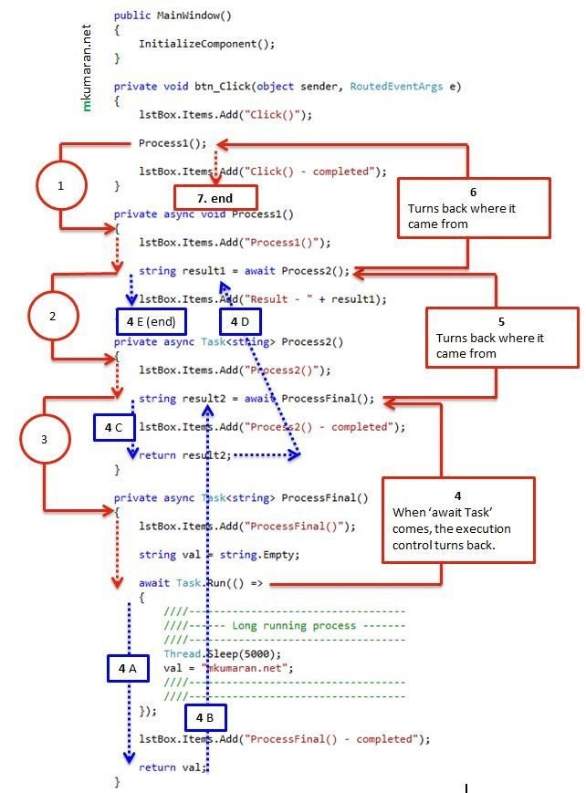
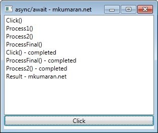

async await keyword in c# with simple example.

###async await – basic example

####XAML
```xaml
<Window x:Class="AsyncAwait.MainWindow" xmlns="http://schemas.microsoft.com/winfx/2006/xaml/presentation" xmlns:x="http://schemas.microsoft.com/winfx/2006/xaml" Title="async/await - mkumaran.net" Height="255" Width="331">
 <StackPanel>
 <ListBox Name="lstBox" Height="200"/>
 <Button Name="btn" Content="Click" Click="btn_Click"/>
 </StackPanel>
</Window>
```

#### C&#35; 
```C#
using System.Threading;
using System.Threading.Tasks;
using System.Windows;
 
namespace AsyncAwait
{
    public partial class MainWindow : Window
    {
        public MainWindow()
        {
            InitializeComponent();
        }
 
        private void btn_Click(object sender, RoutedEventArgs e)
        {
            lstBox.Items.Add("Click()");             
            Process1(); 
            lstBox.Items.Add("Click() - completed");
        }
 
        private async void Process1()
        {
            lstBox.Items.Add("Process1()"); 
            string result1 = await Process2(); 
            lstBox.Items.Add("Result - " + result1);
        }
 
        private async Task<string> Process2()
        {
            lstBox.Items.Add("Process2()"); 
            string result2 = await ProcessFinal(); 
            lstBox.Items.Add("Process2() - completed"); 
            return result2;
        }
 
        private async Task<string> ProcessFinal()
        {
            lstBox.Items.Add("ProcessFinal()"); 
            string val = string.Empty; 
            await Task.Run(() =&amp;gt;
            {
                ////-----------------------------------
                ////------ Long running process -------
                ////-----------------------------------
                Thread.Sleep(5000);
                val = "mkumaran.net";
                ////-----------------------------------
                ////-----------------------------------
            });
 
            lstBox.Items.Add("ProcessFinal() - completed"); 
            return val;
        }
    }
}
```

####Execution flow



####Output


####Explanation
1.	Button click event calls “Process1()” this function can also be called using ‘await’
2.	Simple function call to “Process1()”
Text “Process1()” is added into list box and “Process2()” function is called (using await)
3.	“ProcessFinal()” function is called and in that function we have long running process.
4.	The ‘await Task.*’ starts the task (4A) and returns back to where it came from because of await keyword.
5.	We have await keyword before ProcessFinal() calling statement so the control will go back again.
6.	Again the control go back to btn_click() function. The “Process1()” was not called using “await” so it will continue the execution
7.	The string “Click() – completed” will be added into list box and the function will end.


* 4A. on step 4, one more task is created and running parallel.
* 4B. normally returning the string value to the caller.
* 4C. resume the execution.
* 4D. returning value
* 4E. resume the execution. The “Process1()” function was not called using ‘await’ so the execution stops here.

After step 3, the step 4 and 4A are executed parallel.

####Read the below external links for more detail explanation
1.	[Simple Async Await Example for Asynchronous Programming](http://stephenhaunts.com/2014/10/10/simple-async-await-example-for-asynchronous-programming/)
2.	[await (C# Reference)](https://msdn.microsoft.com/en-IN/library/hh156528.aspx)

