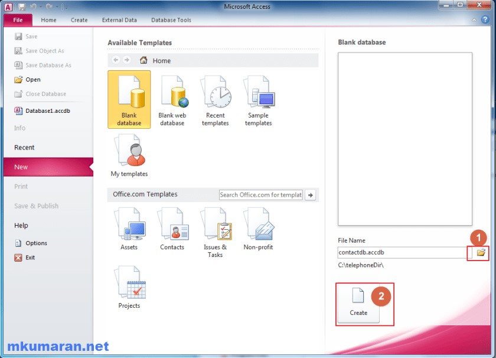

I will show absolute beginner tutorial for VB6.0 with database connections (using ADO). This will helpful you to get started further. I know VB 6.0 is quite old and It’s [IDE is no longer supported by Microsoft](http://blogs.msdn.com/b/nikosan/archive/2012/04/20/support-statement-for-visual-basic-6-0-on-windows-8.aspx). But still some legacy applications are running in VB6 runtime.

####VB6.0
VB6.0 was nice and great language for me to create database applications in the late 90’s. But nowadays people mostly use C#.net and WPF for window based applications. Also we don’t get any article from google for VB6.0. So I decide the write simple tutorial for those who want to learn database application in VB6.0 to support their legacy application.

We will see simple read only application which will search the name in database and fetch the relevant details into a form.

#####Step 1 : Create database

Create a new folder “C:\telephoneDir”

Open “MS-Access”. Click ‘Browse’ icon to select newly created folder (C:\telephoneDir) then click ‘Create’ button.

