## TL;DR

1. I used Ad blocker in browser to stop Ads.
2. Thats only for browser, what about Mobile and TVs?!
3. I used Pi-hole and Raspberry-Pi to block network-wide Ads.
4. This blog is all about my own experience on using Pi-hole.

## Pi-hole

Mostly we use [Ghostery](https://www.ghostery.com/) and [uBlock Origin](https://github.com/gorhill/uBlock) for ad blocking in browser. We can use [Pi-hole](https://pi-hole.net/), it is a network-wide ad blocker. Instead of installing adblockers on browser, we can install Pi-hole once on our network, and it will protect all of our devices. Because it works differently than a browser-based ad-blocker, Pi-hole also block ads in non-traditional places, such as in games and on smart TVs.

## Raspberry Pi

Raspberry-Pi and SD-Card

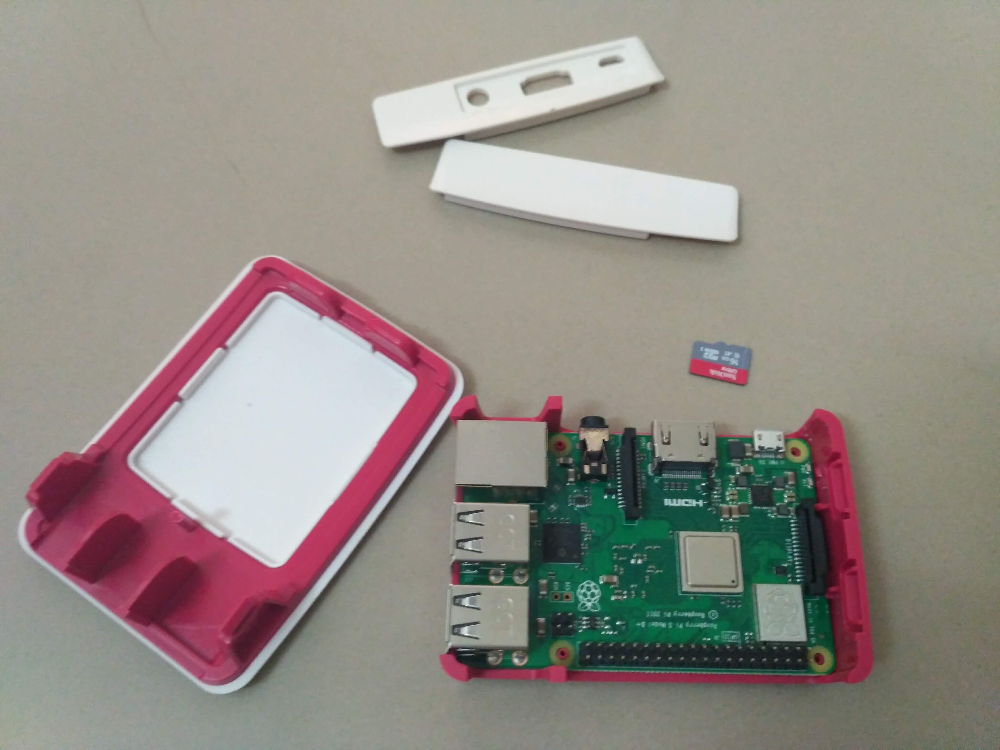

## 1. Download Required software

### 1.1 Raspbian for Raspberry Pi

We have to setup raspberry pi first, for the same download [Raspbian](https://www.raspberrypi.org/downloads/raspbian/) OS.

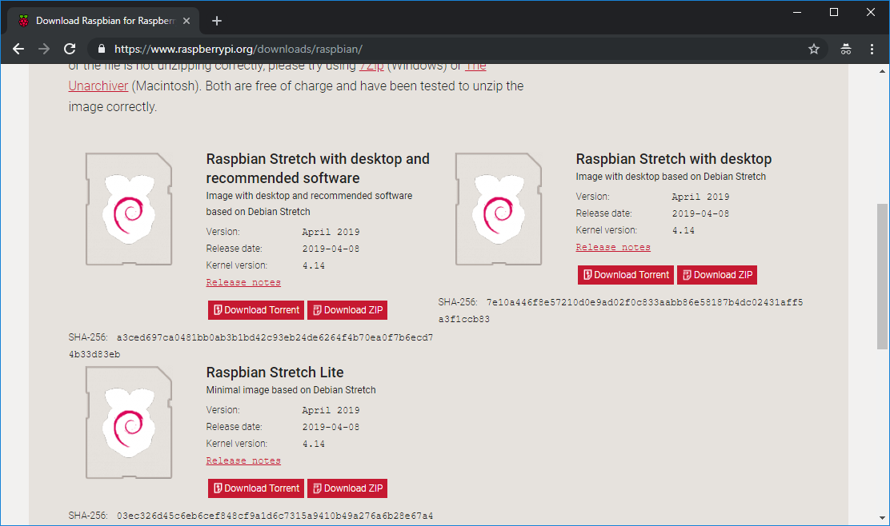

### 1.2 Flash software

Once downloaded the Raspbian we need a software to put into Raspberry Pi. We can use [Etcher Flash](https://www.balena.io/etcher/) to flash OS images to SD cards & USB drives.

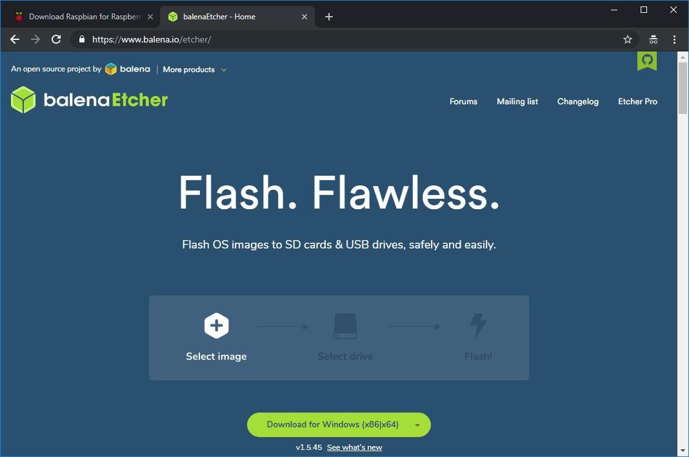

Download and install the flash software

## 2. Flashing Raspbian into SD card

1. Insert the SD card into system
2. Open the flash software

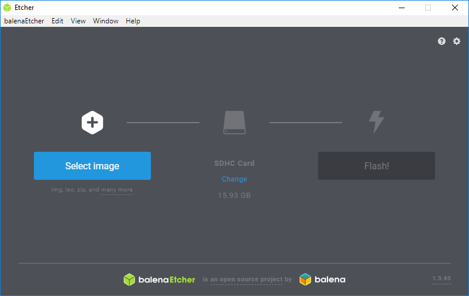

3. Browser and select the downloaded Raspbian from step 1.1

4. flashing

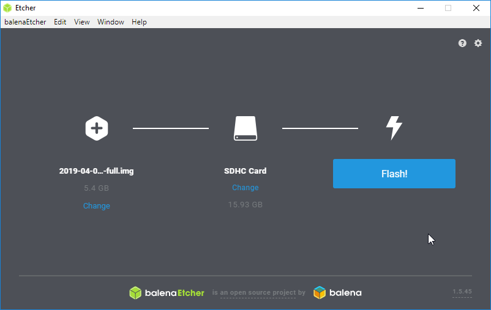

## Power-on Raspberry-Pi

I connected my Pi to TV through HDMI cable.

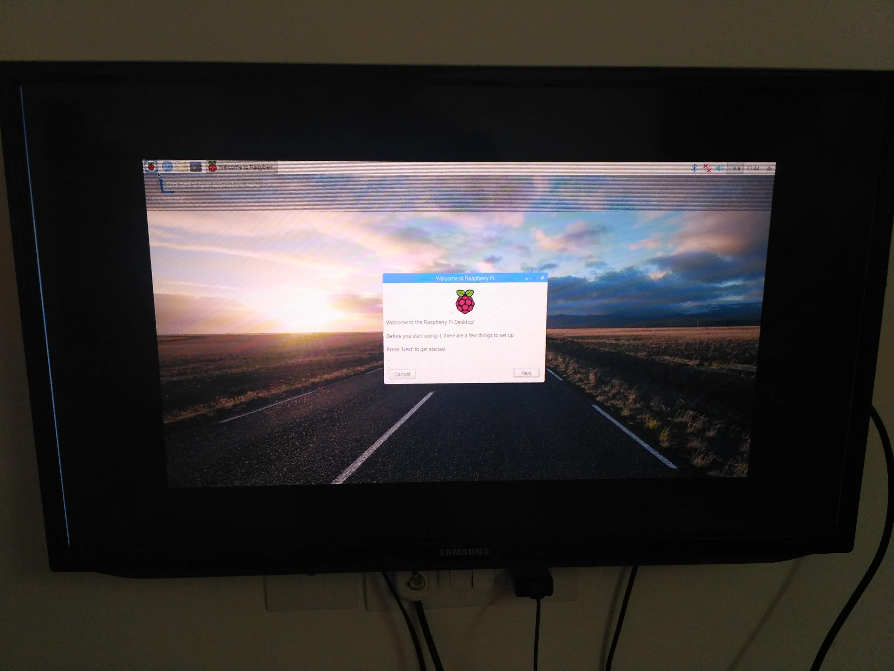

## 3. Install Pi-hole on Raspberry Pi

once the flash done, insert the SD card into Raspberry-pi and power on.

1. Open terminal in raspberry pi
2. Type the below command to install pi-hole

```bash
curl -sSL https://install.pi-hole.net | bash
```

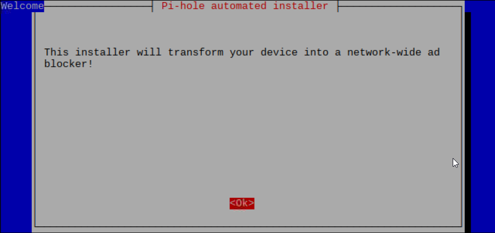

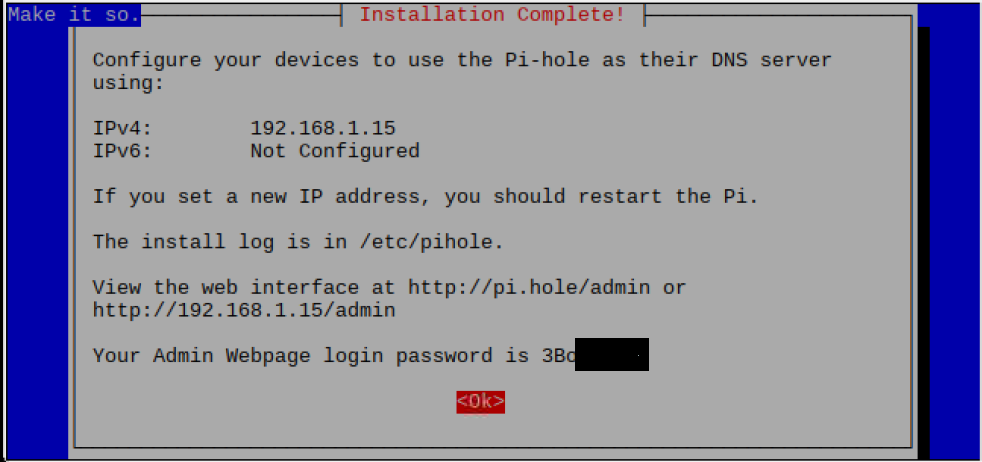

Note the password from the above screen

## 4. Config Wifi router

The next step is configure our Wifi router to use Pi-hole as DNS server.

Open router's config page http://192.168.1.1

use default admin password

go to DHCP server configuration page.

**Ensure that you make changes on LAN page, not on WLAN page**

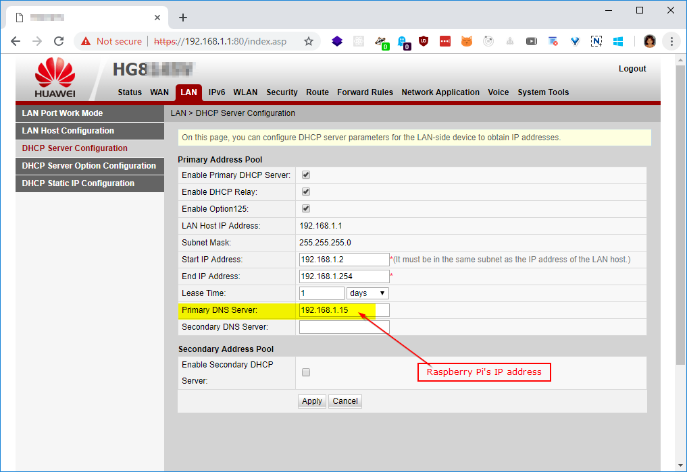

Enter the raspberry-pi's IP address as DNS address

Re-start the router.

Read detailed information on how to configure the DHCP [here](https://discourse.pi-hole.net/t/how-do-i-configure-my-devices-to-use-pi-hole-as-their-dns-server/245)

## 5. After Pi-hole installed

Open Pi-hole admin page http://192.168.1.15/admin/. It's Raspberry-Pi's IP address.

Type the password which we noted on step #3.

85% of my network is blocked which are for advertisment purpose.

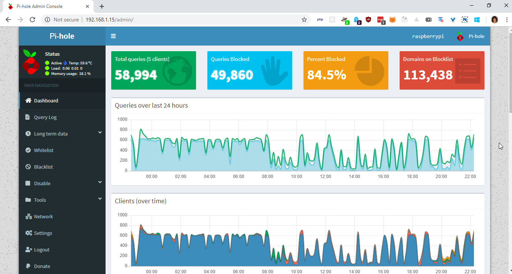

## Remote desktop connection to Pi (optional)

Once the Pi connected into WiFi-network, we can disconnect the display and connect the Pi through remote desktop using [VNC viewer](https://www.realvnc.com/en/connect/download/viewer/).

I used VNC viewer to connect my Pi.

Read [this tutorial](http://www.circuitbasics.com/access-raspberry-pi-desktop-remote-connection/) for remote desktop for Pi.

## Connect Pi through SSH

After flashed the OS, just insert the SD card in to the computer (not into Pi) and just create an empty file called "ssh" (without quotes) then insert the SD card and power on the Pi. Now we can connect the Pi from a SSH client.

I used putty from windows to connect my Pi through SSH.

Read [this tutorial](https://www.raspberrypi.org/magpi/ssh-remote-control-raspberry-pi/) to connect Pi through SSH.

## Issues I faced

I don't have keyboard !!!

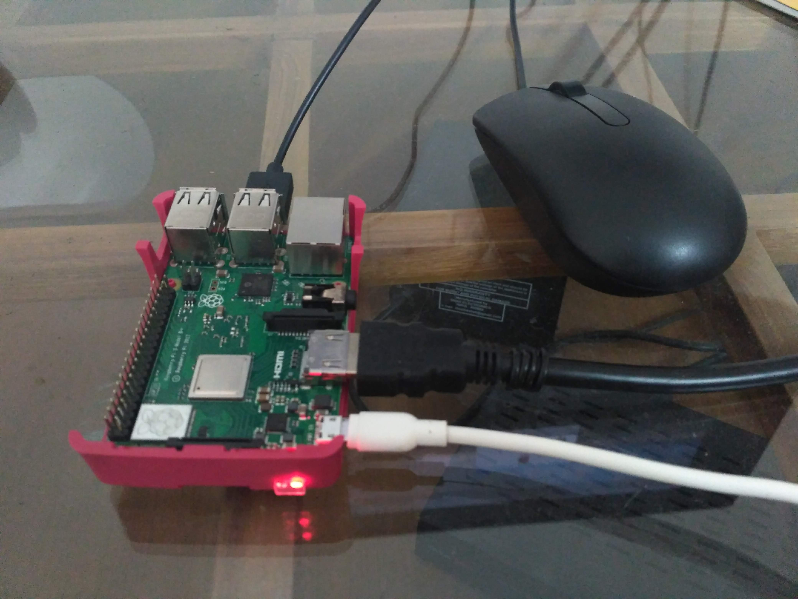

1. I don't have USB keyboard to connect Raspberry-Pi. I connected the Pi into my TV using HDMI and connected a USB mouse, but no keyboard! I managed to copy paste the text from file name.
2. Copied each and every character from a file name. I opened the file explorer in Pi and search the required character in a file/folder name, then right click on it --> rename, then select a particular character copy it then paste it into the terminal.
3. Finally, I didn't know how to press enter on terminal without keyboard, then luckily I pressed mouse middle button on terminal and it exectued that line. (Mouse middle button sends enter key on terminal to execute the typed line)
4. I didn't know my router's login password. Only username is mentioned on the back-side of the router. I used all possible combination like admin/admin, user/user and searched on net, but didn't work, finally I called to my broadband service provider to get my router's password. The password was my relationship number (like client id).
