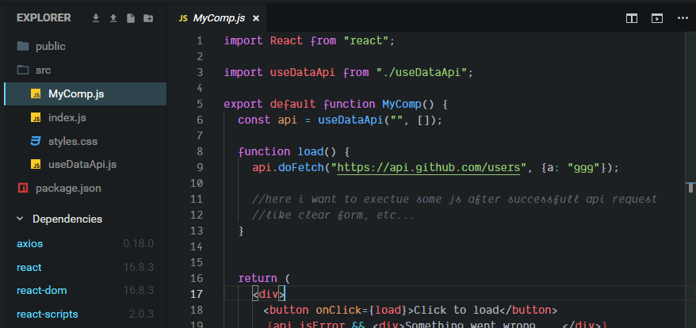

##How to fetch data with React Hooks?
You will mostly end-up with [Robin's blog post](https://www.robinwieruch.de/react-hooks-fetch-data/) regarding the fecth method. But the problem using useState() is that we can't execute any other code after fetch success.

for an example:- do one fetch, if that fetch is successfull then call some JavaScript like clear the form using useState(), if fails display error message. That's somehow difficult if we use useState().

##fetch using useState()
I created a [codesandbox](https://codesandbox.io/s/qvxm4z4qn4) based on best practices to fetch data using hooks. Please feel free to update the script to make some Js after the fetch.



in that codesandbox, try to execute some Js after the fetch. It won't work becase it's sync code.

##Always use useReducer() to fetch data
I am not big fan of useState() method due to it's nature. I decided to use only useReducer() to fetch data and async operations. It's same like Redux style.

1. Create two useReducer()
2. one for sync and the other for async (ajax and side effects)
3. use the async reducer as a main and call the other reducer inside.
4. if you see the code, you can easily understand :)

###Reducer for sync - only for state changes

```JavaScript
function reducer(state, action) {
  console.log(action.type);

  switch (action.type) {
    case "INIT_LOAD":
      return {
        ...state,
        isLoading: true,
        isError: false
      };
    case "LOAD_SUCCESS":
      return {
        ...state,
        isLoading: false,
        isError: false,
        data: action.data
      };
    case "LOAD_ERROR":
      return {
        ...state,
        isLoading: false,
        isError: true
      };
    default:
      return state;
  }
}
```

###Reducer for async - side effects and fetch

```JavaScript
function dispatchMiddleware(dispatch) {
  return async action => {
    switch (action.type) {
      case "LOAD":
        console.log("LOAD");
        try {
          const result = await axios("https://api.github.com/users");
          dispatch({ type: "LOAD_SUCCESS", data: result.data });
        } catch (e) {
          dispatch({ type: "LOAD_ERROR" });
        }
        break;

      default:
        return dispatch(action);
    }
  };
}
```

###Component

```JavaScript
export default function Users() {
  const [state, dispatchBase] = useReducer(reducer, initialState);

  const dispatch = dispatchMiddleware(dispatchBase);

  console.log("rendering...", state);

  function load() {
    console.log("in load()");
    dispatch({ type: "INIT_LOAD" });
    dispatch({ type: "LOAD" });
    console.log("load() - done");
  }

  let Display = null;

  if (state.isLoading) {
    Display = <div>Loading...</div>;
  } else if (state.isError) {
    Display = <div>Error</div>;
  } else {
    Display = state.data.map(item => <div key={item.login}>{item.login}</div>);
  }

  return (
    <div>
      <button onClick={load}>Load</button>
      {Display}
    </div>
  );
}
```

## Full code

```JavaScript
import React, { useReducer } from "react";
import axios from "axios";

function dispatchMiddleware(dispatch) {
  return async action => {
    switch (action.type) {
      case "LOAD":
        console.log("LOAD");
        try {
          const result = await axios("https://api.github.com/users");
          dispatch({ type: "LOAD_SUCCESS", data: result.data });
        } catch (e) {
          dispatch({ type: "LOAD_ERROR" });
        }
        break;

      default:
        return dispatch(action);
    }
  };
}

function reducer(state, action) {
  console.log(action.type);

  switch (action.type) {
    case "INIT_LOAD":
      return {
        ...state,
        isLoading: true,
        isError: false
      };
    case "LOAD_SUCCESS":
      return {
        ...state,
        isLoading: false,
        isError: false,
        data: action.data
      };
    case "LOAD_ERROR":
      return {
        ...state,
        isLoading: false,
        isError: true
      };
    default:
      return state;
  }
}

const initialState = {
  isLoading: false,
  isError: false,
  data: []
};

export default function Users() {
  const [state, dispatchBase] = useReducer(reducer, initialState);

  const dispatch = dispatchMiddleware(dispatchBase);

  console.log("rendering...", state);

  function load() {
    console.log("in load()");
    dispatch({ type: "INIT_LOAD" });
    dispatch({ type: "LOAD" });
    console.log("load() - done");
  }

  let Display = null;

  if (state.isLoading) {
    Display = <div>Loading...</div>;
  } else if (state.isError) {
    Display = <div>Error</div>;
  } else {
    Display = state.data.map(item => <div key={item.login}>{item.login}</div>);
  }

  return (
    <div>
      <button onClick={load}>Load</button>
      {Display}
    </div>
  );
}

```

The full code is available in the [codesandbox](https://codesandbox.io/s/5227w5pkln)
