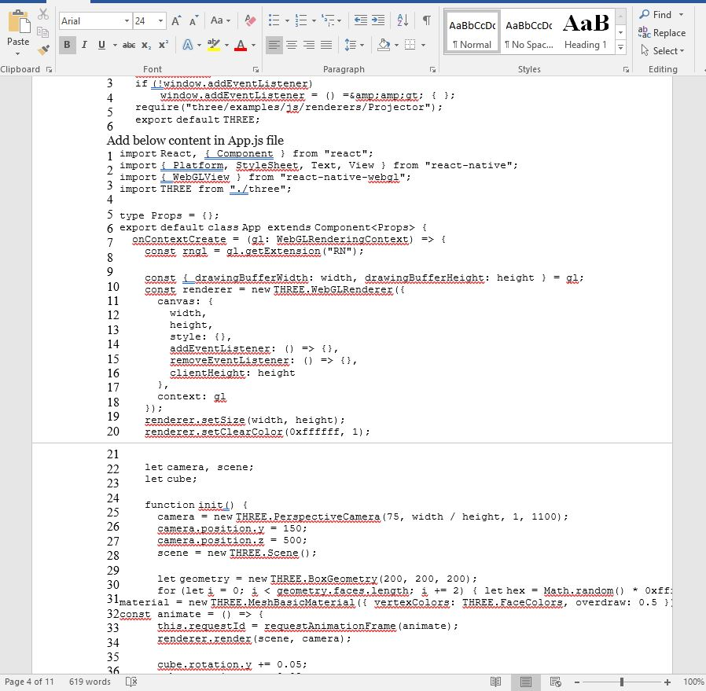
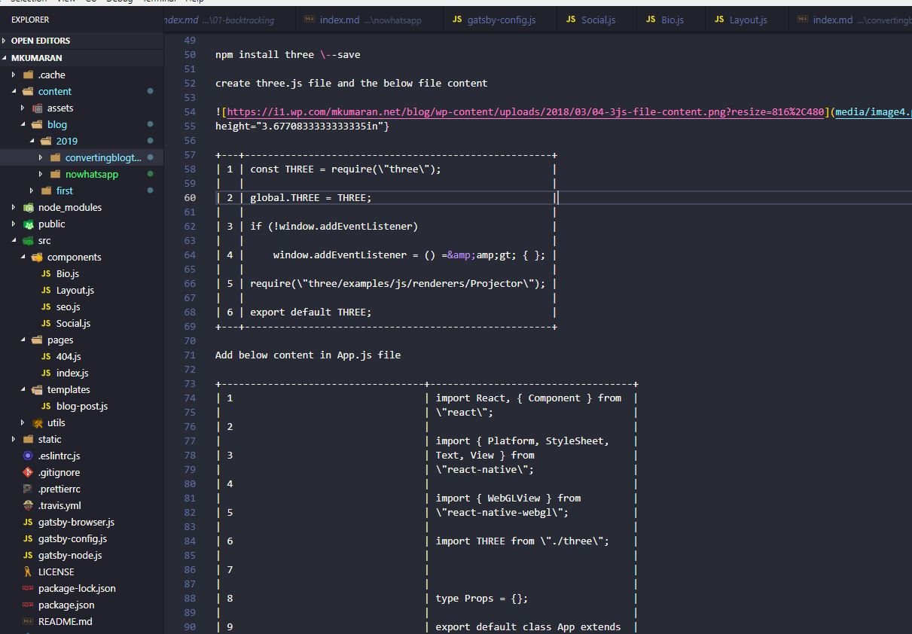

###I had my blog on wordpress.
Early days [PHP](http://php.net/) was ruling the web and I learned PHP and created my website in WordPress and hosted. It was quite good and nice.

###I learned JavaScript
I knew js already (we can’t imaging without js for a webpage) with [jQuery](https://jquery.com/) and Ajax then [NodeJs](https://nodejs.org/) came into lime light. It was more promising. I liked the event driven and web-sockets in Nodejs very much. Also don’t need to learn one more language for server side, in my case it’s PHP.

###Wanted to update my blog
I decided to move my blog from PHP to JavaScript and I already started [ReactJs](https://reactjs.org/) in my projects, so obviously I ended with [Gatsby](https://www.gatsbyjs.org/) which is really cool.

###Backup
I didn’t had much blog to backup. It was only 7 blogs!!! (I have to write more blogs, in 2019 you will see more ;) ) so I just simply copy paste the content into a MS-Word file and saved.

###Gatsby
It is really nice framework for static web pages (not only for this, for now I use this for blogging). I started with [Gatsby's starter blog](https://www.gatsbyjs.org/starters/gatsbyjs/gatsby-starter-blog/), that recipe was very simple, I just have to create markdown files in content folder and it was automatically shown in my site! I manully copy paste the content from the word file to editor(md format).

####Pandoc
I tried to use [pandoc](https://pandoc.org/) to convert my word file and it didn’t go well because my word file is not properly formated due to line numbers in source code, also it was just only 7 articles, instead of automating that conversion, copy/paste was efficient.

####My blog backup as word format

####After converted to md using pandoc

I dind't had much posts, so I manually copied and pasted.