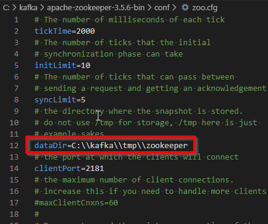
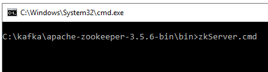

## Required software to download
Download below software
1. [Java runtime environment](https://www.oracle.com/technetwork/java/javase/downloads/jre8-downloads-2133155.html). We need oracle account to download.
2. [Zookeeper](http://zookeeper.apache.org/releases.html) Extract the content into folder `C:\kafka\apache-zookeeper-3.5.6-bin`. (There are tow files in download location, download the `bin` file.)
3. [Kafka](http://kafka.apache.org/downloads.html) Extract into `C:\kafka\kafka_2.12-2.3.1`

## Install - Java SE Runtime Environment 8

click install to start installing

### Set Java home variable

1. Control panel --> System settings
2. Advanced system settings
3. Environment variables
4. Add new
5. Give variable name as `JAVA_HOME` and vale as the JRE installed location path. By default it will be at `C:\Program Files\Java\jre1.8.0_231`

### Set path variable for Java
1. Select path variable
2. Edit
3. Give `%JAVA_HOME%\bin`

### Ensure java version from command prompt
run `java -version` in command prompt to check the java installation

## Apache ZooKeeper

Ensure that you downloaded the `bin` file from the download location. The other file(without bin) is also having the same content but it won't work (don't know exactly why!)

## Config Zookeeper
1. Go to folder `C:\kafka\apache-zookeeper-3.5.6-bin\conf`
2. Copy paste the config file `zoo_sample.cfg` as `zoo.cfg`
3. Open `zoo.cfg` file in a text editor then change the `dataDir` value to `C:\\kafka\\tmp\\zookeeper` (ensure double back slashes `\\` used, if in windows)

## Config Kafka
1. Open `C:\kafka\kafka_2.12-2.3.1\config\server.properties` file to make config changes.
2. Update `log.dirs` values as `C:\\kafka\\tmp\\kafka-logs`

# It's time to Run kafka
## Start zookeeper
Go to `C:\kafka\apache-zookeeper-3.5.6-bin\bin` folder in command prompt then run `zkServer.cmd`

## Start Kafka
1. Ensure that zookeeper is running.
2. Run below command from `C:\kafka\kafka_2.12-2.3.1` to start kafka
`.\bin\windows\kafka-server-start.bat .\config\server.properties`

3. Basically we have to run `kafka-server-start.bat` file with config file as 2nd argument.

# Test the kafka is working fine

## Start producer
Open a new command prompt in the location `C:\kafka\kafka_2.12-2.3.1\bin\windows`

Run the below command to start a new producer
`kafka-console-producer.bat --broker-list localhost:9092 --topic test`

## Start consumer
Open one more new command prompt in the same location and run the below command to start consumer and monitor `test` topic.
`kafka-console-consumer.bat --bootstrap-server localhost:9092 --topic test`

## Testing by sending sample message

Type something in producer window and press enter the same message will appear in the consumer window.

If everything works fine, congrats, you have successfully started kafka. :)