## Install Andriod studio

click next
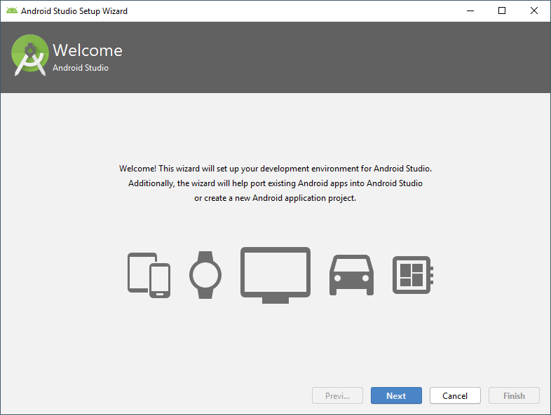

select custom
select theme

select below options
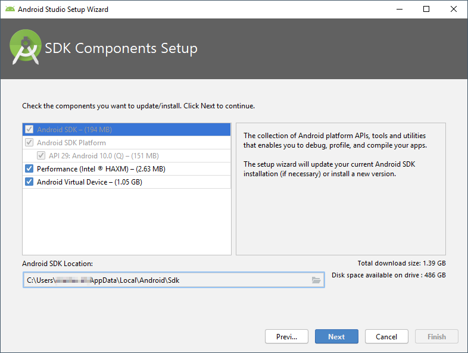

set Ram for emulator

next
it will download the components
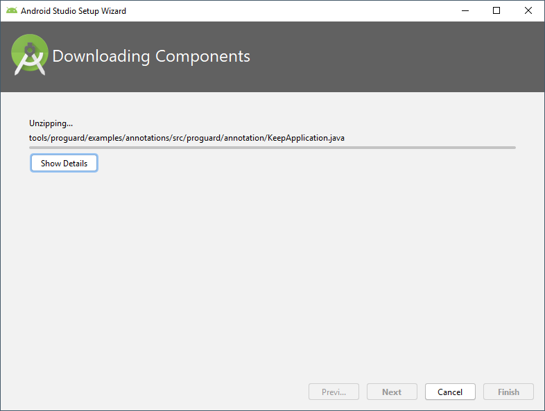

once done, click finish

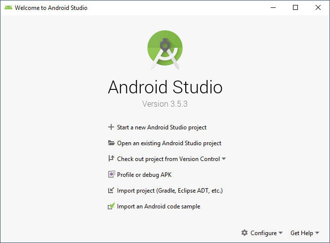
click configure in the above screen and select SDK manager

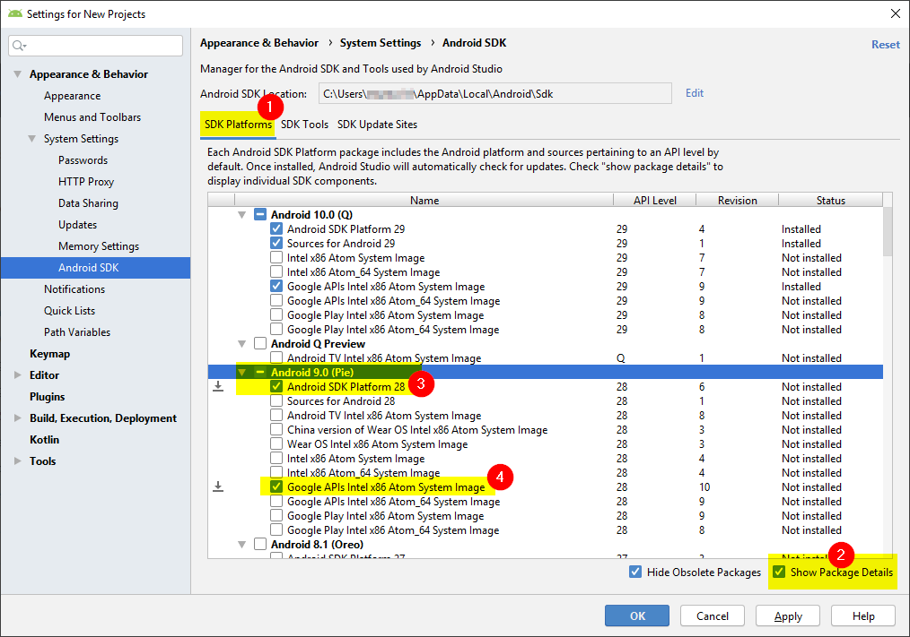

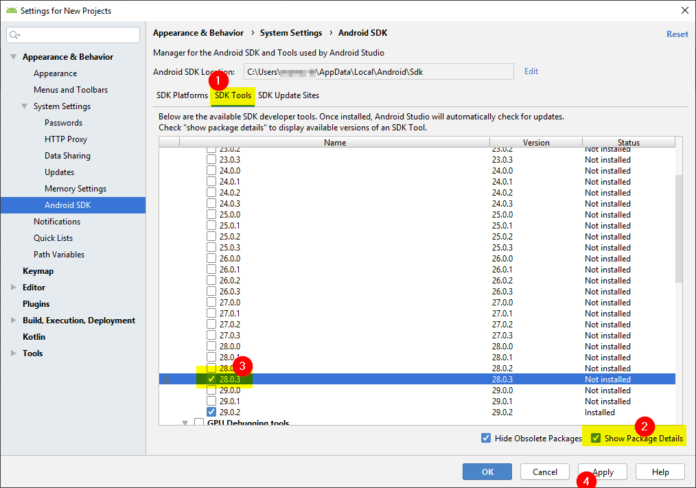
click apply

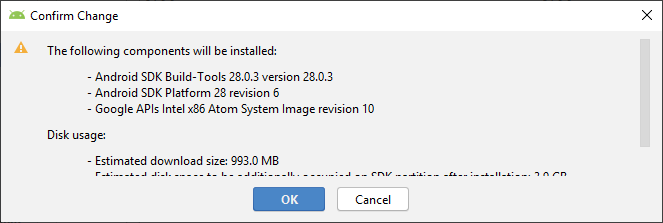

select arm-dbt license and accept
select sdk-license again click accept
click next
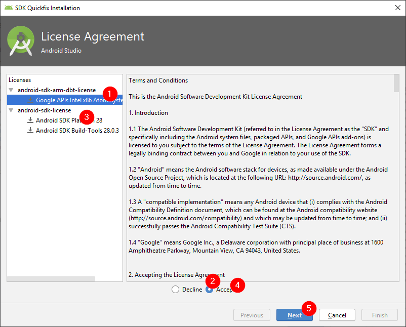

component will be installed
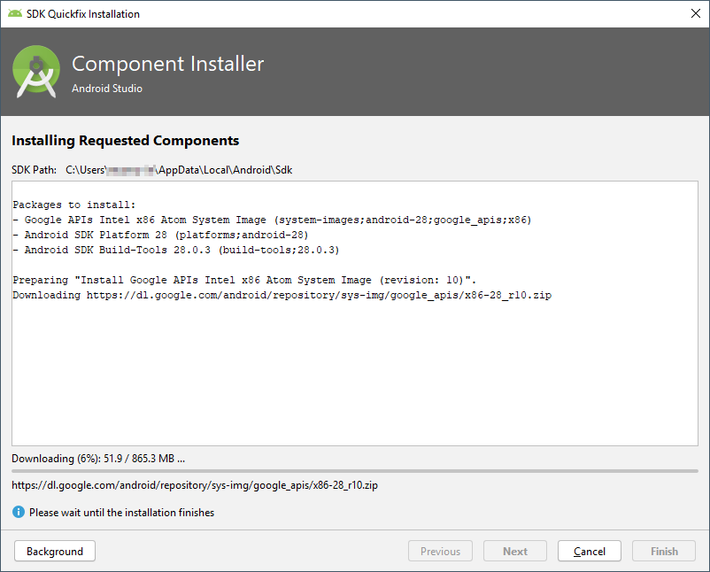
once done, click finish
again we will be back to the component selection screen and click OK.

## Setting Andriod home environment variable

The SDK is installed, by default, at the following location: `C:\Users\YOUR_USERNAME\AppData\Local\Android\Sdk`
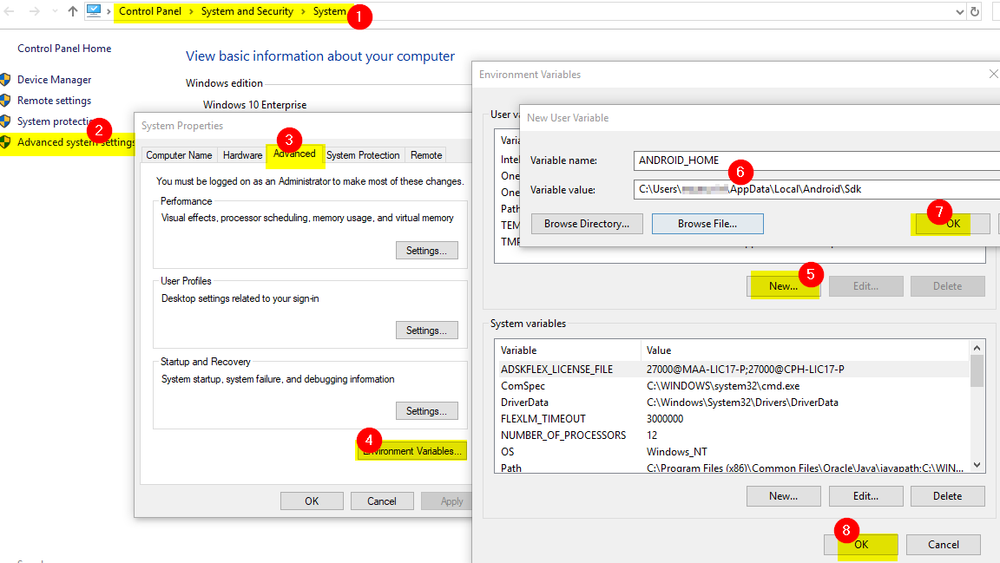

## Add platformtools to path

The default location for this folder is: `C:\Users\YOUR_USERNAME\AppData\Local\Android\Sdk\platform-tools`
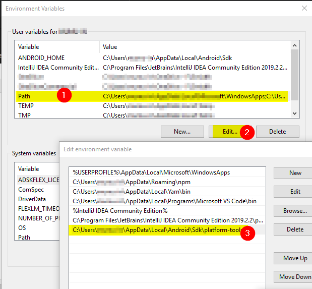

## Open virtual device

in welcome to andriod studio screen --> configure --> AVD manager

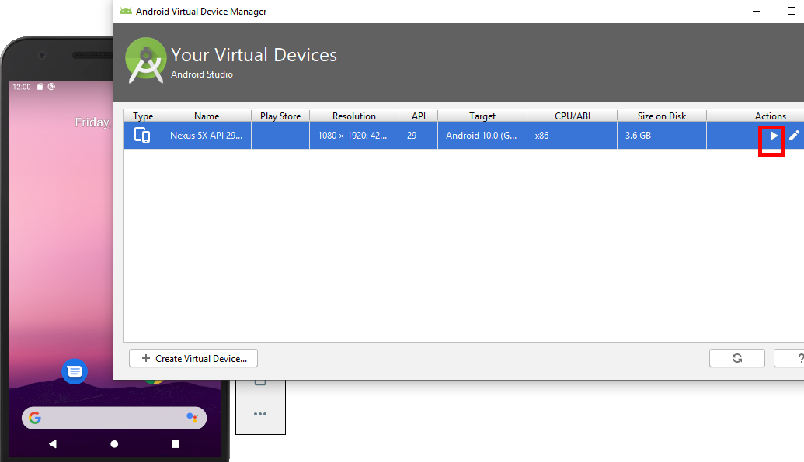

# React native

## create project

run below command to create react native project
`npx react-native init <projectname>`

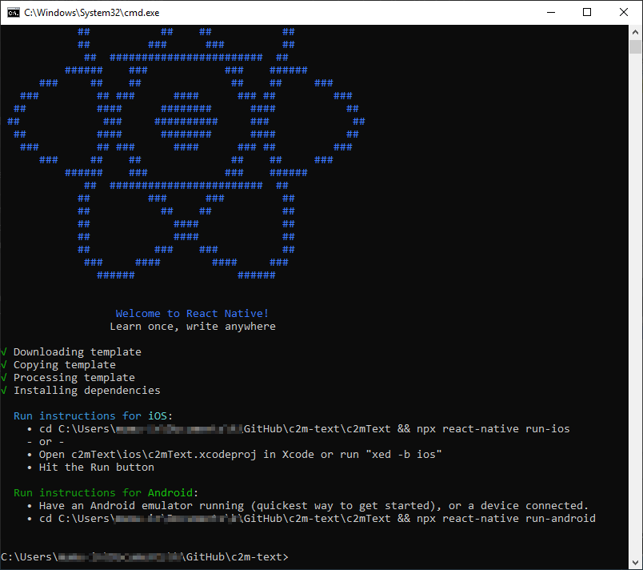

## Add java path in your project

open `android\gradle.properties` file and add `org.gradle.java.home` config

```
android.useAndroidX=true
android.enableJetifier=true
org.gradle.java.home=C:\\Program Files\\Java\\jdk1.8.0_202
```

## run the project

Ensure that the andriod emulator is running
run below command
`npx react-native run-andriod`
when we run that we will get one more `node` command prompt opened.

finally we can see the running react native in the emulator
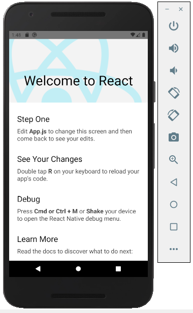

Update the `app.js` and save, it will be automatically refreshed in the emulator.
