Two versions of ActiveMQ

1. ActiveMQ 5 "Classic"
2. ActiveMQ Artemis

## Pre-Installation

Java Runtime Environment (JRE) is needed

## Download

download ActiveMq from https://activemq.apache.org/
Download link https://activemq.apache.org/components/classic/download/

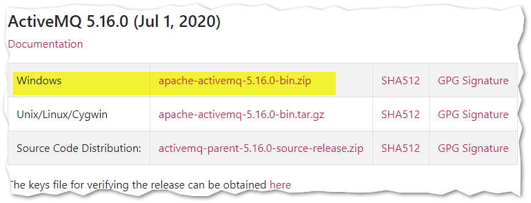

Extract the files into a directory

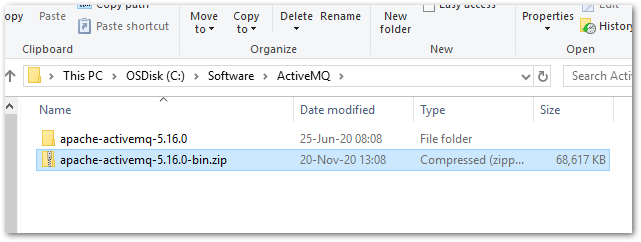

## Start

Run activemq start command to start the server
`C:\....\apache-activemq-5.16.0\bin> activemq start`

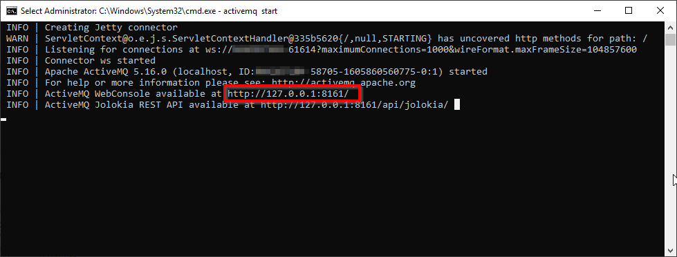

ActiveMQ will start a webserver which is displayed on the screen

open the below link in browser, you will be asked to enter password, use the below.
http://127.0.0.1:8161/admin/

```
username: admin
password: admin
```

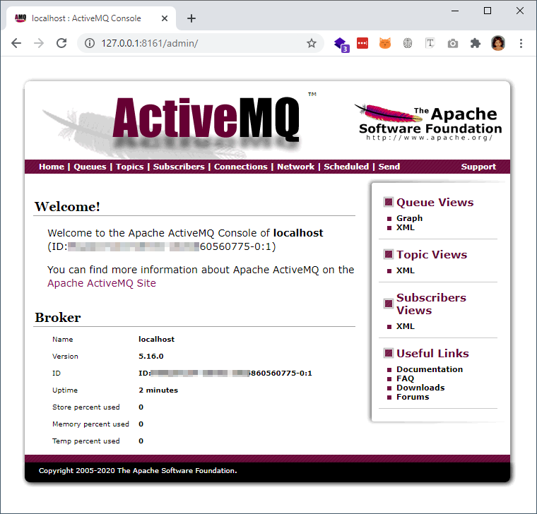

### Create a queue

1. Click `Queues` link
2. Type a queue name
3. Click create

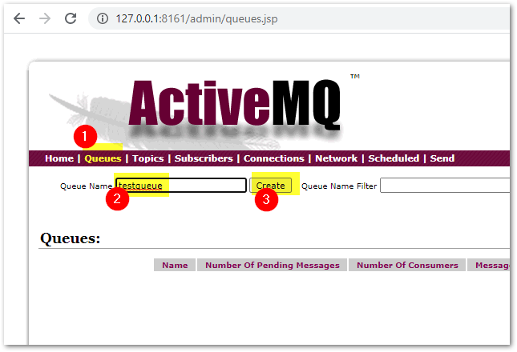

### Queue created

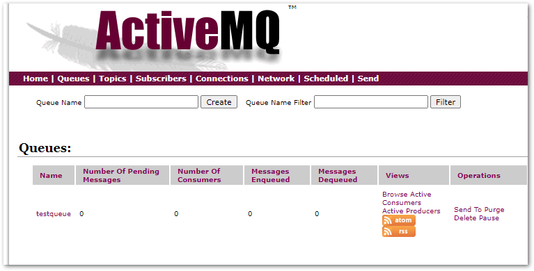

## Create a C# WPF project for producer

1. Tools --> Nuget package --> Manage nuget packge for solution
2. search for `activemq`
3. select `Apache NMS ActiveMQ`
4. install the package.

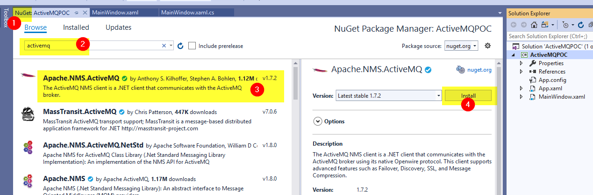

### Default port for ActiveMQ

`61616` is the default port for ActiveMQ, so we have to connect `localhost:61616`

### Create producer and send message in C

Create below XAML in the window

```XML
<Grid>
        <StackPanel Margin="10">
            <StackPanel Orientation="Horizontal">
                <Button Content="Send message"
                        Name="sendButton"
                        Click="SendButton_Click" />
            </StackPanel>
        </StackPanel>
    </Grid>
```

Type below code in code behind. I wanted to keep the code simple, so didn't use MVVM concept, just simply using code behind.

```Csharp
using Apache.NMS;
using Apache.NMS.ActiveMQ;
using System;
using System.Windows;

namespace ActiveMQPOC
{
    /// <summary>
    /// Interaction logic for MainWindow.xaml
    /// </summary>
    public partial class MainWindow : Window
    {
        private IConnection connection;
        private ISession session;
        private IMessageProducer producer;

        public MainWindow()
        {
            InitializeComponent();
        }

        private void Init()
        {
            Uri connecturi = new Uri("activemq:tcp://localhost:61616");
            ConnectionFactory connectionFactory = new ConnectionFactory(connecturi);

            // Create a Connection
            this.connection = connectionFactory.CreateConnection();
            this.connection.Start();

            // Create a Session
            this.session = connection.CreateSession(AcknowledgementMode.AutoAcknowledge);

            // Get the destination (Topic or Queue)
            IDestination destination = this.session.GetQueue("testqueue");

            // Create a MessageProducer from the Session to the Topic or Queue
            this.producer = this.session.CreateProducer(destination);
            this.producer.DeliveryMode = MsgDeliveryMode.NonPersistent;
        }

        private void SendButton_Click(object sender, RoutedEventArgs e)
        {
            // Create a messages
            String text = "Test msg : " + DateTime.Now;
            ITextMessage message = session.CreateTextMessage(text);

            // Tell the producer to send the message
            this.producer.Send(message);
        }

        private void Window_Loaded(object sender, RoutedEventArgs e)
        {
            this.Init();
        }

        private void Window_Closing(object sender, System.ComponentModel.CancelEventArgs e)
        {
            // Clean up
            session.Close();
            connection.Close();
        }
    }
}
```

### Running the producer

1. Run our producer program and click `send message`
2. Go to ActiveMQ admin page and navigate to `Queues` page
3. Refresh the page to see the updated value.
4. we can see the number of pending messages.

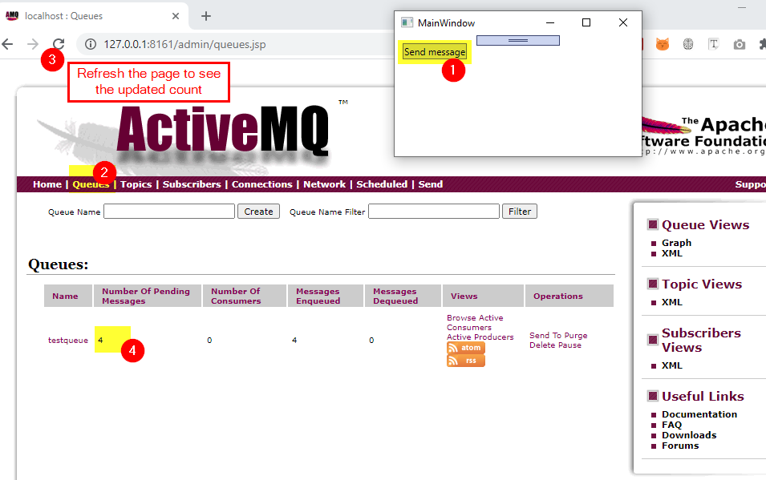

## Create a C# WPF project for consumer

create one more C# project in the same solution.
Add the same nuget package in this project also.

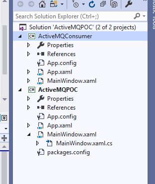

### Consumer UI

simple add a list box in xaml

```xml
    <Grid>
        <ListBox Name="lstBox">
        </ListBox>
    </Grid>
```

### Consumer C# code

add below code in the windows's code behind

```Csharp
using Apache.NMS;
using Apache.NMS.ActiveMQ;
using System;
using System.Threading.Tasks;
using System.Windows;

namespace ActiveMQConsumer
{
    /// <summary>
    /// Interaction logic for MainWindow.xaml
    /// </summary>
    public partial class MainWindow : Window
    {
        private IConnection connection;
        private ISession session;
        private IMessageConsumer consumer;

        public MainWindow()
        {
            InitializeComponent();
        }

        private void Init()
        {
            Uri connecturi = new Uri("activemq:tcp://localhost:61616");
            ConnectionFactory connectionFactory = new ConnectionFactory(connecturi);

            // Create a Connection
            this.connection = connectionFactory.CreateConnection();
            this.connection.Start();

            // Create a Session
            this.session = connection.CreateSession(AcknowledgementMode.AutoAcknowledge);

            // Get the destination (Topic or Queue)
            IDestination destination = this.session.GetQueue("testqueue");

            // Create a MessageProducer from the Session to the Topic or Queue
            this.consumer = this.session.CreateConsumer(destination);
            this.consumer.Listener += Consumer_Listener;
        }

        private void Consumer_Listener(IMessage message)
        {
            var txtMessage = message as ITextMessage;
            lstBox.Dispatcher.Invoke(() => {
                lstBox.Items.Add(txtMessage.Text);
            });
        }

        private void Window_Loaded(object sender, RoutedEventArgs e)
        {
            this.Init();
        }

        private void Window_Closing(object sender, System.ComponentModel.CancelEventArgs e)
        {
            // Clean up
            consumer.Close();
            session.Close();
            connection.Close();
        }
    }
}
```

## Run Producer and Consumer program at the same time

in visual studio, right click on a project --> Debug --> Start a new instance.
start producer and consumer project.

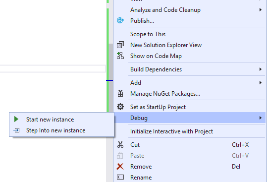

### Running screen

by clicking the send message at producer program, we can see the messages reached at consumer's side.
At the same time we can refresh the admin webpage to see the status.

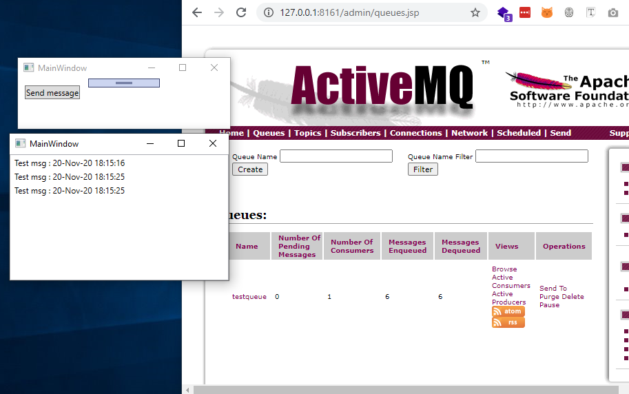
