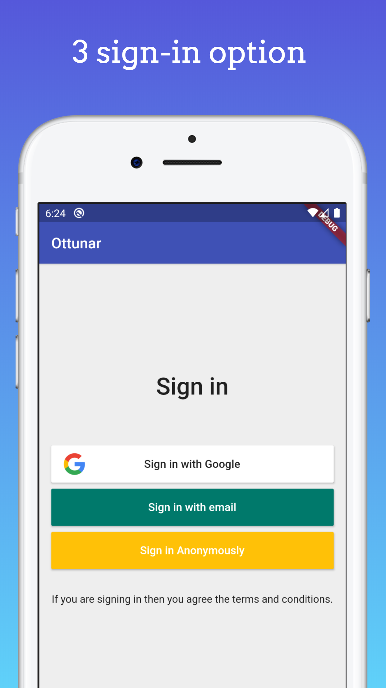
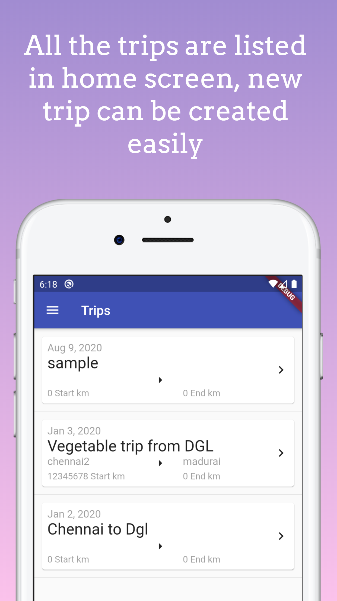
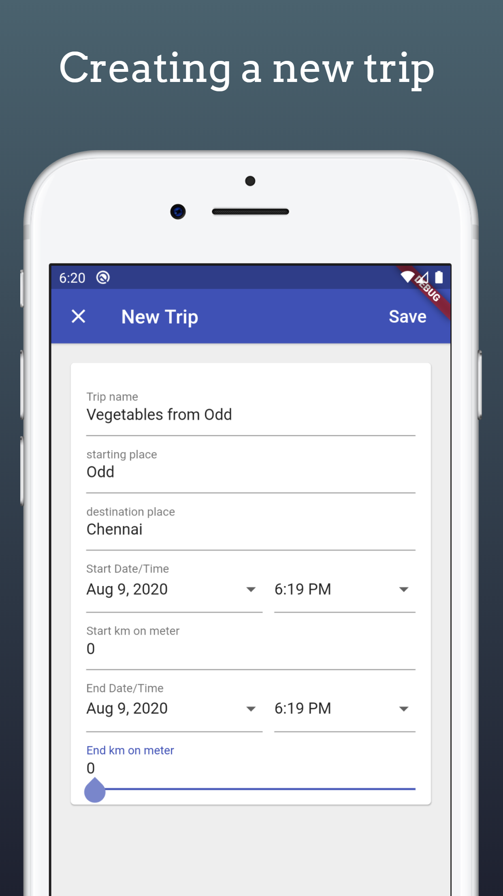
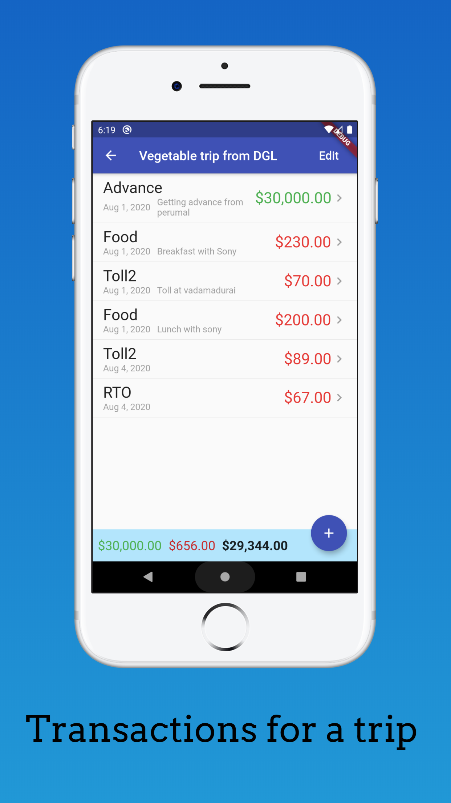
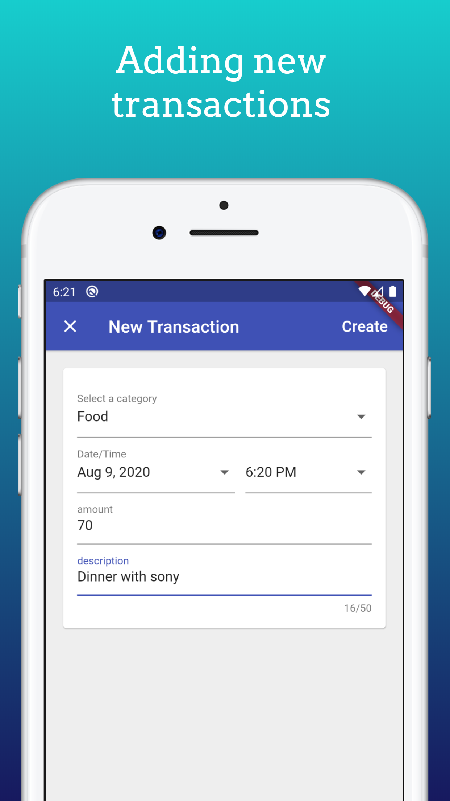
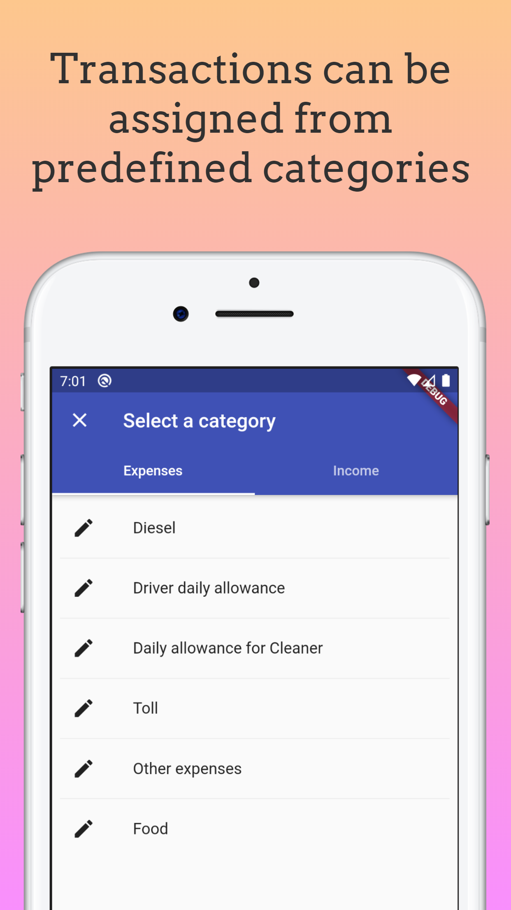
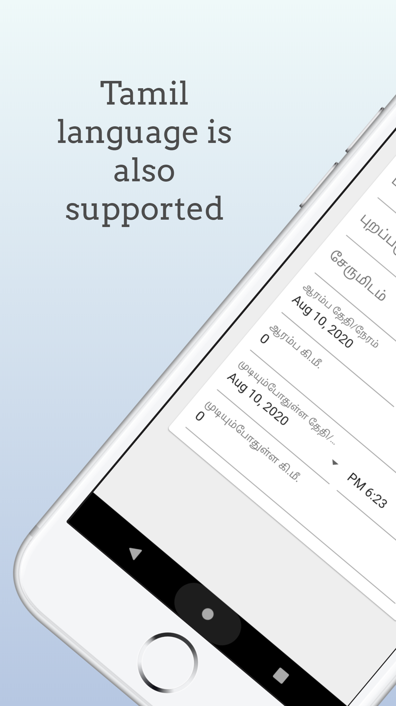

I created a mobile app for truck drivers to manage their expenses. It is a simple and light weight.

[download from play store](https://play.google.com/store/apps/details?id=net.mkumaran.ottunar&hl=en)

## Tech used

I used [Flutter](https://flutter.dev/) and [Firebase](https://firebase.google.com/) to create this app. I used firebase ealier but never tried flutter but it's really nice. Flutter seems more promising in mobile app development.

## App screens

### Expenses in category

Instead of typing the expense/income everytime user can select from list, and they can create a new category also.

### Multiple language support

Only Tmail language is supported now. But implementing other language is very simple just adding a file with translation.

If you want this app in your language please contact me in [twitter](https://twitter.com/kumaran_muthu) and I am happy to do that.

