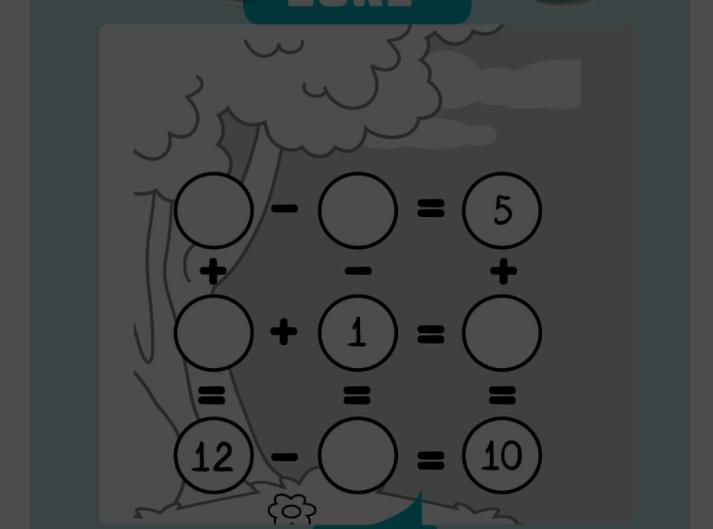

I received a picture puzzle in WhatsApp. I will explain here how I solved that using programming. I used [Backtracking](http://www.thegeekstuff.com/2014/12/backtracking-example/) concept.

## Received picture puzzle
below puzzle is simple algebra concept. If you have paper and pencile then it can be solved easily. But I just wanted to use some programming concept.



## Algebra notation of the puzzle
just fill the empty circle with some letters `(a,b,c,d,e)`

Left to right
```
a  - b =  5
c  + 1 =  d
12 - e = 10
```

Top to bottom
```
a + c = 12
b - 1 =  e
5 + d = 10
```

## Program concept

now we have the equations, just take first equation `a-b=5`. This is simple equation and we can easily tell that `a and b` can have multiple posibilities like `a=10, b=5` or `a=15, b=10` etc...

we will solve the above equation using backtrack. Just asign sequence of numbers and check all the possibilites. 

```js
for(let a = 0; a <= 50; a++) {
	for(let b = 0; b <= 50; b++) {
		
	}	
}
```
Here we created two for loops with maximum values of 50. The concept here is that loop through `a` from 0 to 50, inside that again loop through `b` from 0 to 50, which means every `a` value will be evaluated with all `b` values.

so, below is the program to solve `a-b=5`
```js
for(let a = 0; a <= 50; a++) {
	for(let b = 0; b <= 50; b++) {
		if (a - b === 5) {
			console.log(`a = ${a}, b = ${b}`)
		}
	}	
}
```

output of the above program 
```
a = 5, b = 0
a = 6, b = 1
a = 7, b = 2
a = 8, b = 3
a = 9, b = 4
...
... more values here
...
a = 47, b = 42
a = 48, b = 43
a = 49, b = 44
a = 50, b = 45
```

## Final program
we can apply the same above concept to solve the all the equations.

notation 
```
a  - b =  5     ---> 1
c  + 1 =  d     ---> 2
12 - e = 10     ---> 3

a + c = 12     ---> 4
b - 1 =  e     ---> 5
5 + d = 10     ---> 6
```

```js
const max = 12;

for (let a = 0; a <= max; a++) {
  for (let b = 0; b <= max; b++) {
    if (a - b === 5) { // <--- 1
      for (let c = 0; c <= max; c++) {
        if (a + c === 12) { // <--- 4
          for (let d = 0; d <= max; d++) {
            if (5 + d === 10 && c + 1 === d) { // <--- 6, 2
              for (let e = 0; e <= max; e++) {
                if (b - 1 === e && 12 - e === 10) { // <--- 5, 3
                  console.log(`${a} ${b} ${c} ${d} ${e}`);
                }
              }
            }
          }
        }
      }
    }
  }
}
```

## Conclusion
Backtracking is a time consuming concept, it's not the best solution here but let's have fun using some program concept.