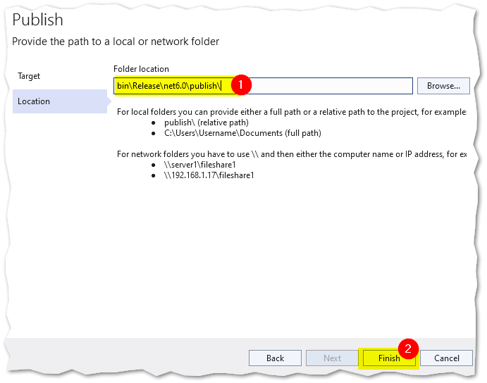

## Install the .NET Core Hosting Bundle

[Download .NET Core Hosting Bundle](https://dotnet.microsoft.com/permalink/dotnetcore-current-windows-runtime-bundle-installer)

Download and install the bundle
Restart the system.


## Publish app

Publish an app means to produce a compiled app that can be hosted by a server

Right click server project then select publish


select folder option


select location then click finish


click publish

## Deploy app

Deploy an app means to move the published app to a hosting system.

- copy the publish folder into IIS system's local folder.
  - Here, I am using two different system. one for development and one for hosting. We generated publish folder in the development system and we have to copy that folder into publish's system.

create site in IIS


select publish folder


Change application pool settings


In turn windows feature on/off, select all application development options like the below.


Change user settings like below screen.


Ensure the test settings works.


## HTTPS in localhost

Open powershell with administrator (run as admin) and run the below command

```
New-SelfSignedCertificate -DnsName "localhost" -CertStoreLocation "cert:\LocalMachine\My"
```


1. Start --> Run --> mmc
2. File -> Add or Remove Snap-ins -> Certificates -> Add -> Computer account -> Local computer. Click Finish.
3. Expand the `Personal` folder and you will see your `localhost` certificate:
4. Copy the certificate into `Trusted Root Certification Authorities` - Certificates folder.


Map https in IIS


Open the port `8080` and `8081` in windows firewall.

Add a new rule `port`, and open `8080` port

now, visit the URL and you can see https in localhost

