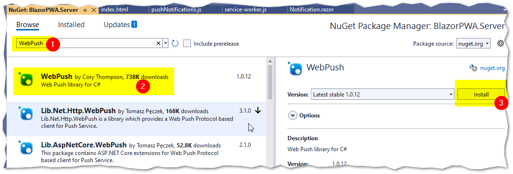
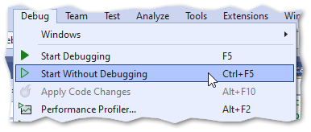
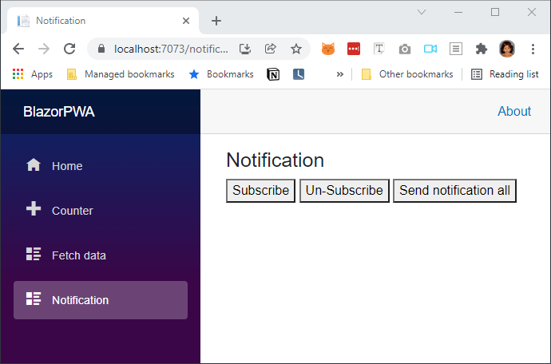

## Create a new Blazor PWA application

In the create new project screen, select `Blazor WebAssembly App`


give project name and location


Select Progressive web application, ASP.NET core hosted option.


Once project created it will be like the below


Run the application


## Create notification screen

add below code into `BlazorPWA\Client\Shared\NavMenu.razor`

```csharp
<div class="nav-item px-3">
    <NavLink class="nav-link" href="notification">
        <span class="oi oi-list-rich" aria-hidden="true"></span> Notification
    </NavLink>
</div>
```

it should be like below after adding that above code.


create new file `Notification.razor` and add simple code like in the below screen.


run the application and ensure that new page is working


### Push notification javascript file

Add new file `pushNotifications.js`


add below code to that file `pushNotifications.js`

```javascript
;(function() {
  // Note: Replace with your own key pair before deploying
  const applicationServerPublicKey = '****Replace*****'

  window.blazorPushNotifications = {
    requestSubscription: async () => {
      const worker = await navigator.serviceWorker.getRegistration()
      const existingSubscription = await worker.pushManager.getSubscription()
      if (!existingSubscription) {
        const newSubscription = await subscribe(worker)
        if (newSubscription) {
          return {
            url: newSubscription.endpoint,
            p256dh: arrayBufferToBase64(newSubscription.getKey('p256dh')),
            auth: arrayBufferToBase64(newSubscription.getKey('auth')),
          }
        }
      }
    },

    unSubscribe: async () => {
      const worker = await navigator.serviceWorker.getRegistration()
      const existingSubscription = await worker.pushManager.getSubscription()
      if (existingSubscription) {
        existingSubscription.unsubscribe()
        return true
      }
    },
  }

  async function subscribe(worker) {
    try {
      return await worker.pushManager.subscribe({
        userVisibleOnly: true,
        applicationServerKey: applicationServerPublicKey,
      })
    } catch (error) {
      if (error.name === 'NotAllowedError') {
        return null
      }
      throw error
    }
  }

  function arrayBufferToBase64(buffer) {
    // https://stackoverflow.com/a/9458996
    var binary = ''
    var bytes = new Uint8Array(buffer)
    var len = bytes.byteLength
    for (var i = 0; i < len; i++) {
      binary += String.fromCharCode(bytes[i])
    }
    return window.btoa(binary)
  }
})()
```

link that file in the `index.html`


create `NotificationSubscription.cs` file under `BlazorPWA.Shared` project.
This is shared class used in client and server side to send/receive data.


add below code

```csharp
using System;
using System.Collections.Generic;
using System.Linq;
using System.Text;
using System.Threading.Tasks;

namespace BlazorPWA.Shared
{
    public class NotificationSubscription
    {
        public int NotificationSubscriptionId { get; set; }
        public string UserId { get; set; }
        public string Url { get; set; }
        public string P256dh { get; set; }
        public string Auth { get; set; }
    }
}
```

## Install webpush nuget in server code

we will use [Webpush](https://github.com/web-push-libs/web-push-csharp/) in server for sending notifications.

Right click server project and select `manage nuget packages`


install `webpush` nuget


Ensure `webpush` is installed


### Generating public and private keys for webpush

This is one time activity. Instead of creating a new project to generate the keys, we use existing code and simply run and delete after generating.

Type below code in `BlazorPWA\Server\Program.cs`

```csharp
var keys = WebPush.VapidHelper.GenerateVapidKeys();
System.Diagnostics.Debug.WriteLine(keys.PrivateKey);
System.Diagnostics.Debug.WriteLine(keys.PublicKey);
```

1. type the code
2. put breakpoint in the next line
3. run the project.
   

In the output window we can see the private and public keys, just copy paste they key somewhere. we have to use that later.

- Once copied, we can stop the execution and delete the key generation code.
- It's not needed again.
- It's temporary code just to generate the keys.


### update client code with public key

open `pushNotifications.js` then replace the publick key with generated key from previous step.

- in real application, we have to pass this public key from a REST service. Keep the key in server and send to client by REST service.
- I just copy pasted the key here for example.
  

## Create notification code in server

create new controller in server


type below code in the new file `NotificationController.cs`

```csharp
using BlazorPWA.Shared;
using Microsoft.AspNetCore.Mvc;
using System.Text.Json;
using WebPush;

namespace BlazorPWA.Server.Controllers
{
    [ApiController]
    [Route("[controller]")]
    public class NotificationController : ControllerBase
    {
        private static List<NotificationSubscription> _subscriptions = new();

        [HttpPost]
        [Route("subscribe")]
        public int Post(NotificationSubscription notificationSubscription)
        {
            _subscriptions.Add(notificationSubscription);
            return _subscriptions.Count();
        }

        [HttpGet]
        [Route("sendall")]
        public async Task<int> Get()
        {
            //Replace with your generated public/private key
            var publicKey = "BN1IymLg1hHX79F7_Uh491570JdJ_1WtlkygDtLQQkV8Oa7pWhMKzSckaN_Q207K7FRX6tI";
            var privateKey = "yV__l2FM56uvh6X3_eGd_ahpWNXzd5Vom7A";

            //give a website URL or mailto:your-mail-id
            var vapidDetails = new VapidDetails("http://mkumaran.net", publicKey, privateKey);
            var webPushClient = new WebPushClient();

            foreach (var subscription in _subscriptions)
            {
                var pushSubscription = new PushSubscription(subscription.Url, subscription.P256dh, subscription.Auth);

                try
                {
                    var payload = JsonSerializer.Serialize(new
                    {
                        message = "this text is from server",
                        url = "open this URL when user clicks on notification"
                    });
                    await webPushClient.SendNotificationAsync(pushSubscription, payload, vapidDetails);
                }
                catch (Exception ex)
                {
                    Console.Error.WriteLine("Error sending push notification: " + ex.Message);
                    //return -1;
                }
            }

            return _subscriptions.Count();
        }
    }
}
```

## Add notification page in client side

open `BlazorPWA\Client\Pages\Notification.razor` file and change the code like below.

```csharp
@inject IJSRuntime JSRuntime
@inject HttpClient Http
@using BlazorPWA.Shared

@page "/notification"

<PageTitle>Notification</PageTitle>

<h3>Notification</h3>

<button @onclick=SubscriptionAsync>Subscribe</button>
<button @onclick=UnSubscriptionAsync>Un-Subscribe</button>
<button @onclick=SendNotificationToAll>Send notification all</button>
<div>@status</div>

@code {
    private string status = "";

    async Task SubscriptionAsync()
    {
        status = "...";

        var subscription = await JSRuntime.InvokeAsync<NotificationSubscription>("blazorPushNotifications.requestSubscription");
        if (subscription != null)
        {
            subscription.UserId = ""; //set user ID
            var response = await Http.PostAsJsonAsync<NotificationSubscription>("Notification/subscribe", subscription);
            int totalSubscribedDevice = await response.Content.ReadFromJsonAsync<int>();
            status = "subscription done. Total device: " + totalSubscribedDevice;
        }
        else
        {
            status = "Already subscribed";
        }
    }

    async Task UnSubscriptionAsync()
    {
        status = "...";
        var unSubscribeStatus = await JSRuntime.InvokeAsync<bool>("blazorPushNotifications.unSubscribe");
        if (unSubscribeStatus)
        {
            //TODO: remove the subscription from server side also.
            status = "un-subscription done";
        }
    }

    async Task SendNotificationToAll()
    {
        status = "...";
        int notificationSentTo = await Http.GetFromJsonAsync<int>("Notification/sendall");
        status = "notification sent to " + notificationSentTo + " devices";
    }
}
```

### add service worker

create new file `Client\wwwroot\service-worker.js`


add below code into that new file

```js
self.addEventListener('fetch', () => {})

self.addEventListener('install', function(event) {
  // The promise that skipWaiting() returns can be safely ignored.
  self.skipWaiting()

  // Perform any other actions required for your
  // service worker to install, potentially inside
  // of event.waitUntil();
})

self.addEventListener('push', event => {
  const payload = event.data.json()
  self.registration.showNotification('Blazor PWA', {
    body: payload.message,
    icon: 'icon-512.png',
    vibrate: [100, 50, 100],
    data: { url: payload.url },
  })
})
```

## Run the application

run the application without debugging (Debug --> Start without debugging)


below is the running webpage


demo screen


## Next

- Here, I just explained the concept and not the best practices.
- Notification in separate device will be treated a new subscription. One user can use multiple devices. so in server side we have to keep all the devices for a user.
- while unsubscribing, we have to remove all the device info in server side also.

In the next post, i will explain how to build and deploy.
