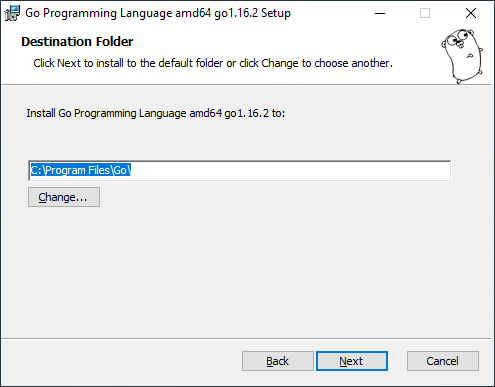

## Installation

download golang from https://golang.org/

Just click next, next in the installation wizard.




Once the installation wizard completes, go to command prompt and type `go version` to check whether it's installed properly.


## Write your first Go program

Create a new folder wherever you want `C:\goprg`
create a simple file under that folder `C:\goprg\my.go`

type below code

```go
package main

import "fmt"

func main() {
    fmt.Println("Hello, World!")
}
```

Open command prompt and go to `C:\goprg` folder and run below command

`go run my.go`

## Create exe

below command to build and create exe

```
go build my.go
```
