## Install

Ensure that python is already installed.
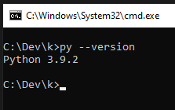

### install virtual environment

```
pip install virtualenvwrapper-win
```

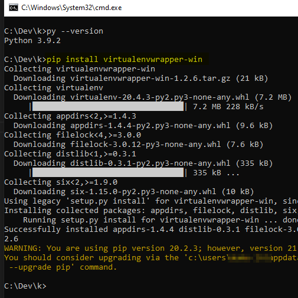

### Create virtual environment

```
mkvirtualenv djangoprj
```

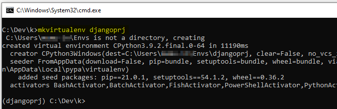

### Install Django

ensure that you are inside the virtual environment

```
pip install django
```

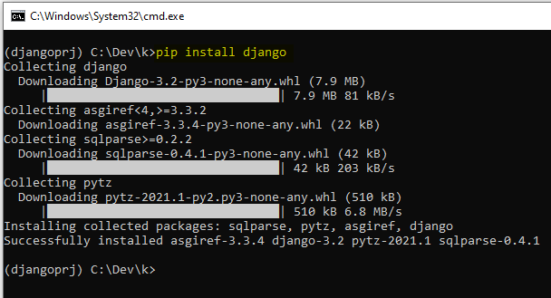

Run below command to check django is installed

```
django-admin --version
```

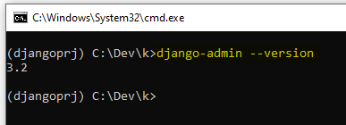

## Create project

```
django-admin startproject djsample
```

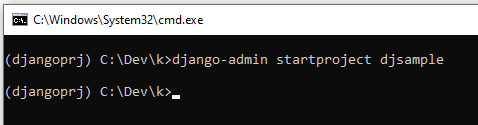

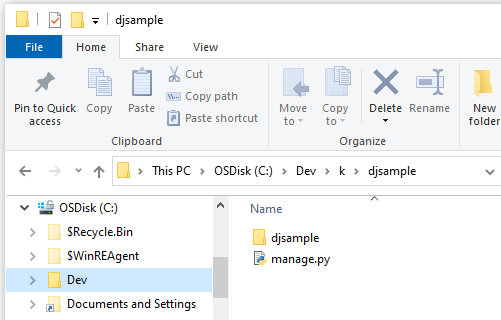

## Run project

```
cd djsample
```

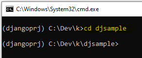

```
py manage.py runserver
```

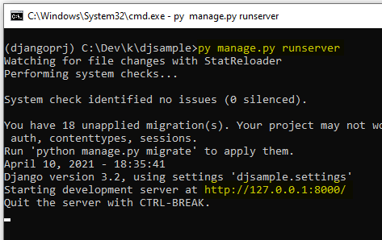
Do not close the above window.

open `http://localhost:8000` in browser.

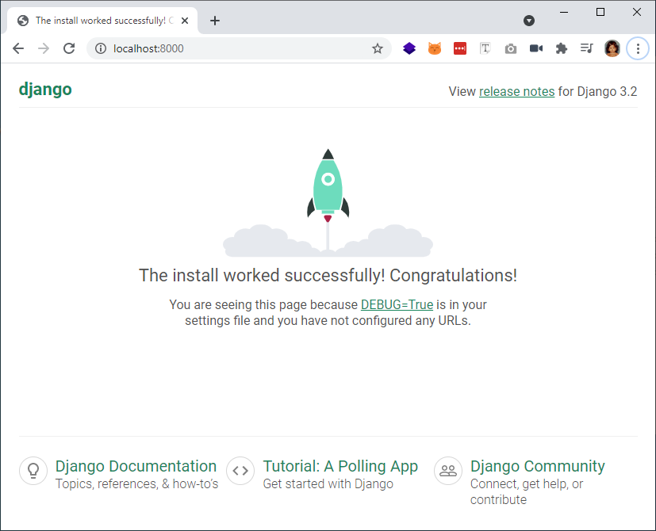

### Enter to virtual environment

from command prompt to enter into virtual environment

```
workon djangoprj
```

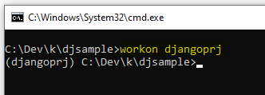

## Admin panel

### create simple app

```
python manage.py startapp app
```

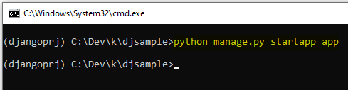

a new folder `app` has been created
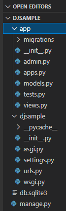

### Database

Install posgreSQL library

```
pip install psycopg2
```

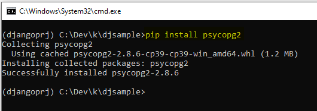

update below database config at `settings.py`

```
DATABASES = {
    'default': {
        'ENGINE': 'django.db.backends.postgresql',
        'NAME': 'mydatabase',
        'USER': 'mydatabaseuser',
        'PASSWORD': 'mypassword',
        'HOST': '127.0.0.1',
        'PORT': '5432',
    }
}

```

### Create model from existing database

Run below command to auto generate models. This will overwrite the exisitng `models.py` file.

```
python manage.py inspectdb > .\app\models.py
```
