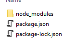
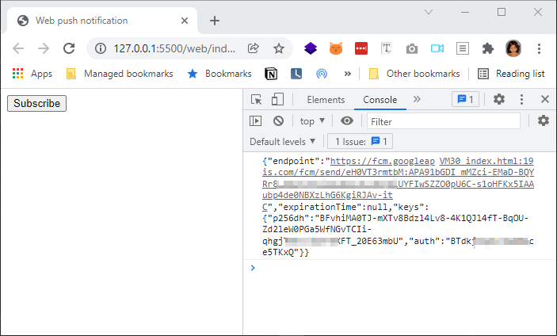

This tutorial is based on a youtube video [Web Push Notifications - End to End implementation](https://www.youtube.com/watch?v=2zHqTjyfIY8)

## Initialize server code

1. create new folder called `server`
2. run `npm init` command inside that `server` folder. After running the npm init command you can see package.json file inside the server folder.
3. we need to install a npm package called `web-push` so run `npm i web-push`

after running above commands, your server folder should be like this

**Server folder**


**package.json file**

```
{
  "name": "web-push-server",
  "version": "1.0.0",
  "description": "server for web push notification",
  "main": "index.js",
  "scripts": {
    "test": "echo \"Error: no test specified\" && exit 1"
  },
  "author": "",
  "license": "ISC",
  "dependencies": {
    "web-push": "^3.4.5"
  }
}
```

### Generate VAPI Keys

create a new file `create-vapi-key.js` in server folder and add the below code.

```js
const push = require('web-push')
const vapiKeys = push.generateVAPIDKeys()
console.log(vapiKeys)
```

Run the above code to get VAPI keys
`node create-vapi-key.js`

```
{
  publicKey: 'BKRYwkit4PdOn*****UF5yrzYycpey3*****VT2sErlYgZZI2DWHSbXfFYC*****_bcMd6hw4*****mZUs7mtVs',
  privateKey: 'i**********bVOx7MNcoymckW*****ZyCfE2ZRmgfBmG3JrQ'
}
```

Save the public and private keys. This is one time activity to get the keys.

### Create push code

Create new file `index.js` in server folder and add the below code.
copy paste the above public/private key in the below code.

```js
const webpush = require('web-push')

// VAPID keys should only be generated only once.
const vapidKeys = {
  publicKey:
    'BKRYwkit4PdOn*****UF5yrzYycpey3*****VT2sErlYgZZI2DWHSbXfFYC*****_bcMd6hw4*****mZUs7mtVs',
  privateKey: 'i**********bVOx7MNcoymckW*****ZyCfE2ZRmgfBmG3JrQ',
}

webpush.setVapidDetails(
  'http://mkumaran.net',
  vapidKeys.publicKey,
  vapidKeys.privateKey
)

// This is the same output of calling JSON.stringify on a PushSubscription from HTML page
const pushSubscription = {
  endpoint: '.....',
  keys: {
    auth: '.....',
    p256dh: '.....',
  },
}

webpush.sendNotification(pushSubscription, 'Your Push Payload Text')
```

## Create web page

Create a new folder `web`

### Create index.html file

create a new file `index.html` inside that web folder.

include below code in theat `index.html` file

```html
<!DOCTYPE html>
<html lang="en">
  <head>
    <meta charset="UTF-8" />
    <meta name="viewport" content="width=device-width, initial-scale=1.0" />
    <meta http-equiv="X-UA-Compatible" content="ie=edge" />
    <title>Web push notification</title>
  </head>
  <body>
    <button onclick="subscribe()">Subscribe</button>

    <script>
      async function subscribe() {
        let sw = await navigator.serviceWorker.ready
        let push = await sw.pushManager.subscribe({
          userVisibleOnly: true,
          applicationServerKey:
            'BKRYwkit4PdOn*****UF5yrzYycpey3*****VT2sErlYgZZI2DWHSbXfFYC*****_bcMd6hw4*****mZUs7mtVs',
        }) //This is public key from server (VAPI keys)
        console.log(JSON.stringify(push))
      }

      if ('serviceWorker' in navigator) {
        addEventListener('load', async () => {
          let sw = await navigator.serviceWorker.register('./sw.js')
          console.log(sw)
        })
      }
    </script>
  </body>
</html>
```

### Create service worker file

create a new file `sw.js` in web folder and add the below code

```js
self.addEventListener('push', () => {
  self.registration.showNotification('Hello world!', {})
})
```

## Run the webpage

we can open the html file in the browser but it won't use the service worker if we open directly. so we will use visualstudio-code's extension to open the html file.
Actullay we have to host that html file somewhere and open the URL, instead we will use localhost.

### Install live server extension

install live server extension from visualstudio code.


Open the `web/index.html` file in visual studio code then right click --> open with live server


You can see the html file running on a browser. Open the console section then click `subscribe` button on the page.
You will get subscription details in the console output.


## Copy the subscription details from webpage

copy that subscription details shown on the console log and paste it into the server's index.js file.

so the updated `server/index.js` file should be like this

```js
const webpush = require('web-push')

// VAPID keys should only be generated only once.
const vapidKeys = {
  publicKey: 'BKRYwkit4PdOnVOMdDUFSbXfFYClbG8l_bcMd6hw4zpqf4mZUs7mtVs',
  privateKey: 'ijWbFUbVOx7MNco1mG3JrQ',
}

webpush.setVapidDetails(
  'http://mkumaran.net',
  vapidKeys.publicKey,
  vapidKeys.privateKey
)

// This is the same output of calling JSON.stringify on a PushSubscription
const pushSubscription = {
  endpoint:
    'https://fcm.googleapis.com/fcm/send/eH0VT3rmtbM:APA91bGDI_mMZci-EMaD-kw6tLDZ13Cz3DrGiUYFIwSZZO0pU6C-s1oHFKx5IAAubp4de0',
  expirationTime: null,
  keys: {
    p256dh: 'BFvhiMA0TJ-mXTv8Bdzl40PGa5WfNGvTCIi-qhgjT91tnlUmrWXFT_20E63mbU',
    auth: 'BTdkjXq4vKxQ',
  },
}

webpush.sendNotification(pushSubscription, 'Your Push Payload Text')
```

## Run the server code

run the `server\index.js` file using `node` command.

`node index.js`


we will get the notification on screen now.


## Reference

1. [Web Push Notifications](https://webpushdemo.azurewebsites.net/)
2. [Youtube video - Web Push Notifications - End to End implementation](https://www.youtube.com/watch?v=2zHqTjyfIY8)
3. [Push notification sample code from Microsoft edge](https://github.com/MicrosoftEdge/pushnotifications-demo)
