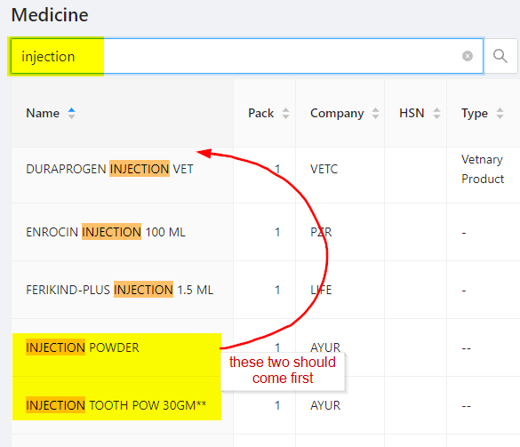
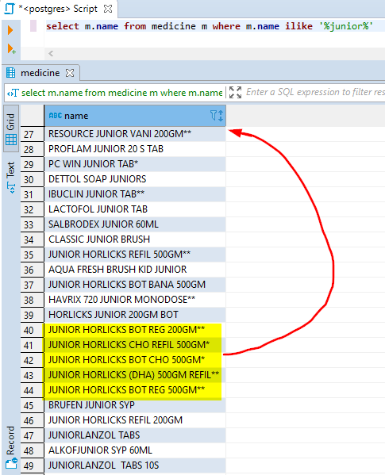
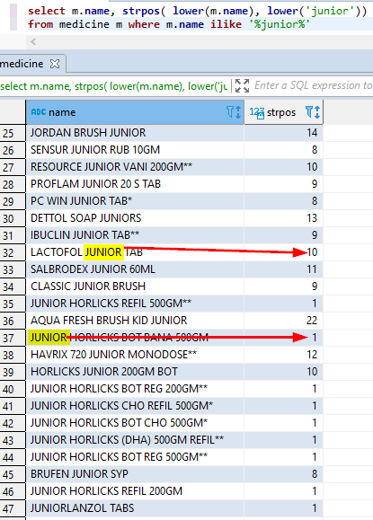
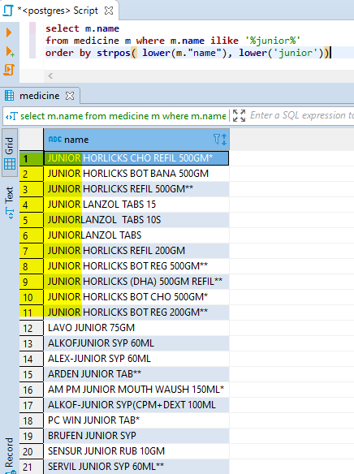
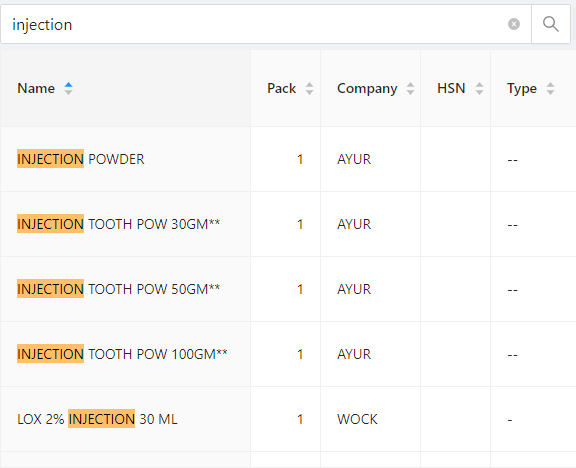

This is article is not about how to use wildcards in PostgreSql, instead of how to use wildcard usefully!

There are lots of good articles about how to use wildcard in PostgreSql.
[How to query with PostgreSQL wildcards like a Pro](https://www.kevinpeters.net/how-to-query-with-postgre-sql-wildcards-like-a-pro)

This article is talking about some issues while using the wildcard and how to solve that.

## Actual problem

`%search-string%` this is what I normally use to query the DB while search something. But, that's not a usefull result because it returns the matching string wherever appears in the column.
But we need the first match at top. See the below image to understand what's the real issue.



## SQL query

The same issue using SQL query. Below SQL query shows how to get the matching rows.

Here I used `%junior%` as wildcard pattern matching string. But the result is not as expected.

```sql
select m.name from medicine m where m.name ilike '%junior%'
```



## strpos() in PostgreSQL

[strpos()](https://www.postgresql.org/docs/current/functions-string.html) is simple string position function in PostgreSQL

```
strpos( fullText, searchableString)

strpos('high', 'ig') → 2

strpos( lower(m.name), lower('junior'))
```

## SQL query with strpos()

We can use strpos to get where exactly the matching string is.



## using strpos() in orderby

So, we can use strpos in order by to get what we need.

```sql
select m.name
from medicine m where m.name ilike '%junior%'
order by strpos( lower(m."name"), lower('junior'))
```



## After applied the strpos()


