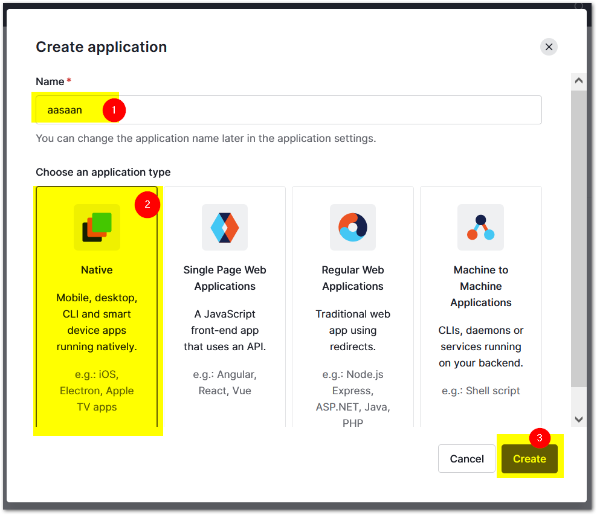

## Setup auth0

1. Go to [auth0](https://auth0.com/) and create an account.
2. In the applications sections, create a new application.
3. Select `native` as application type




In the `collections` section ensure `username-password-authentication` and `google-oauth2` is checked.


In the `settings` section give call back URL as `net.mkumaran.aasaan://login-callback`


## Create flutter app

`flutter create --org net.mkumaran aasaan`
To know more about how to create flutter. Read this [create flutter](http://mkumaran.net/2022/gettingstartedFlutter/)

run below command to run
`flutter run`

Add below line in `pubspec.yaml`

```
http: ^0.13.4
flutter_appauth: ^4.0.0
flutter_secure_storage: ^5.0.2
```


run `flutter pub get`


### Change min sdk

`android\local.properties`

```
sdk.dir=C:\\Users\\*******\\AppData\\Local\\Android\\sdk
flutter.sdk=C:\\flutter
flutter.buildMode=debug
flutter.versionName=1.0.0
flutter.versionCode=1

flutter.minSdkVersion=21
flutter.targetSdkVersion=29
```

`android\app\build.gradle`

```
defaultConfig {
    // TODO: Specify your own unique Application ID (https://developer.android.com/studio/build/application-id.html).
    applicationId "net.mkumaran.aasaan"
    minSdkVersion localProperties.getProperty('flutter.minSdkVersion').toInteger()
    targetSdkVersion localProperties.getProperty('flutter.targetSdkVersion').toInteger()
    versionCode flutterVersionCode.toInteger()
    versionName flutterVersionName
    manifestPlaceholders += ['appAuthRedirectScheme': 'net.mkumaran.aasaan']
}
```


```dart
import 'dart:convert';
import 'dart:developer';

import 'package:aasaan/login.dart';
import 'package:aasaan/profile.dart';
import 'package:flutter/material.dart';

import 'package:http/http.dart' as http;
import 'package:flutter_appauth/flutter_appauth.dart';
import 'package:flutter_secure_storage/flutter_secure_storage.dart';

const FlutterAppAuth appAuth = FlutterAppAuth();
const FlutterSecureStorage secureStorage = FlutterSecureStorage();

const String AUTH0_ISSUER = 'mkumaran.eu.auth0.com';
const String AUTH0_DOMAIN = 'https://$AUTH0_ISSUER';
const String AUTH0_CLIENT_ID = '*** client id copied from auth0 website ***';
const String AUTH0_REDIRECT_URI = 'net.mkumaran.aasaan://login-callback';

void main() {
  runApp(const MyApp());
}

class MyApp extends StatelessWidget {
  const MyApp({Key? key}) : super(key: key);

  // This widget is the root of your application.
  @override
  Widget build(BuildContext context) {
    return MaterialApp(
      title: 'Aasaan',
      theme: ThemeData(
        primarySwatch: Colors.blue,
      ),
      home: const MyHomePage(title: 'Aasaan Home Page'),
    );
  }
}

class MyHomePage extends StatefulWidget {
  const MyHomePage({Key? key, required this.title}) : super(key: key);

  final String title;

  @override
  State<MyHomePage> createState() => _MyHomePageState();
}

class _MyHomePageState extends State<MyHomePage> {
  bool isBusy = false;
  bool isLoggedIn = false;
  String errorMessage = "";
  String name = "";
  String picture = "";
  String nickname = "";

  @override
  Widget build(BuildContext context) {
    return Scaffold(
      appBar: AppBar(
        title: const Text('Auth0'),
      ),
      body: Center(
        child: isBusy
            ? const CircularProgressIndicator()
            : isLoggedIn
                ? Profile(logoutAction, name, nickname, picture)
                : Login(loginAction, errorMessage),
      ),
    );
  }

  dynamic parseIdToken(String idToken) {
    final List<String> parts = idToken.split('.');
    assert(parts.length == 3);

    return jsonDecode(
        utf8.decode(base64Url.decode(base64Url.normalize(parts[1]))));
  }

  Future<dynamic> getUserDetails(String accessToken) async {
    const String urlstring = '$AUTH0_DOMAIN/userinfo';
    var url = Uri.parse(urlstring);
    final http.Response response = await http.get(
      url,
      headers: <String, String>{'Authorization': 'Bearer $accessToken'},
    );

    if (response.statusCode == 200) {
      return jsonDecode(response.body);
    } else {
      throw Exception('Failed to get user details');
    }
  }

  Future<void> loginAction() async {
    setState(() {
      isBusy = true;
      errorMessage = '';
    });

    try {
      final AuthorizationTokenResponse? result =
          await appAuth.authorizeAndExchangeCode(
        AuthorizationTokenRequest(
          AUTH0_CLIENT_ID,
          AUTH0_REDIRECT_URI,
          issuer: AUTH0_DOMAIN,
          scopes: <String>['openid', 'profile', 'offline_access'],
        ),
      );

      if (result == null || result.idToken == null) {
        throw Exception('Failed to get token');
      }

      if (result.accessToken == null) {
        throw Exception('Failed to get access token');
      }

      final idToken = parseIdToken(result.idToken.toString());
      final profile = await getUserDetails(result.accessToken.toString());

      await secureStorage.write(
          key: 'refresh_token', value: result.refreshToken);

      setState(() {
        isBusy = false;
        isLoggedIn = true;
        name = idToken['name'].toString();
        picture = profile['picture'].toString();
        nickname = profile['nickname'].toString();
      });
    } on Exception catch (e, s) {
      debugPrint('login error: $e - stack: $s');

      setState(() {
        isBusy = false;
        isLoggedIn = false;
        errorMessage = e.toString();
      });
    }
  }

  Future<void> logoutAction() async {
    await secureStorage.delete(key: 'refresh_token');
    setState(() {
      isLoggedIn = false;
      isBusy = false;
    });
  }

  @override
  void initState() {
    initAction();
    super.initState();
  }

  Future<void> initAction() async {
    final String? storedRefreshToken =
        await secureStorage.read(key: 'refresh_token');
    if (storedRefreshToken == null) return;

    setState(() {
      isBusy = true;
    });

    try {
      final TokenResponse? response = await appAuth.token(TokenRequest(
        AUTH0_CLIENT_ID,
        AUTH0_REDIRECT_URI,
        issuer: AUTH0_DOMAIN,
        refreshToken: storedRefreshToken,
        scopes: <String>['openid', 'profile', 'offline_access'],
      ));

      if (response == null) {
        throw Exception('Failed to get token response');
      }

      if (response.idToken == null) {
        throw Exception('Failed to get idToken');
      }

      if (response.accessToken == null) {
        throw Exception('Failed to get accessToken');
      }

      final idToken = parseIdToken(response.idToken.toString());
      final profile = await getUserDetails(response.accessToken.toString());

      await secureStorage.write(
          key: 'refresh_token', value: response.refreshToken);

      setState(() {
        isBusy = false;
        isLoggedIn = true;
        name = idToken['name'].toString();
        picture = profile['picture'].toString();
        nickname = profile['nickname'].toString();
      });
    } on Exception catch (e, s) {
      debugPrint('error on refresh token: $e - stack: $s');
      await logoutAction();
    }
  }
}

```
