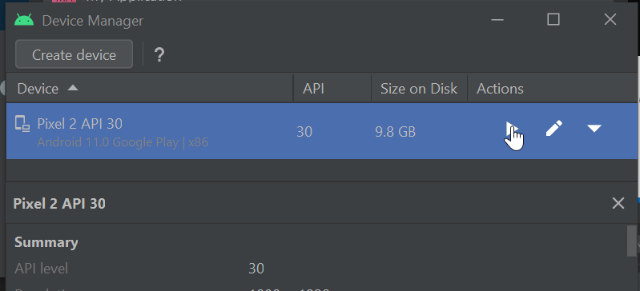

## 1. Install Flutter

* Go to https://flutter.dev/ and download the SDK. 
* It is a zip file. Extract that content into C:\


### 1.1 Update environment variable
add `c:\flutter\bin` into path environment variable.


### 1.2 Ensure that environment variable is set correctly.
go to command prompt and run the below command

```
where flutter dart
```


run `flutter doctor` command


## 2. Install andriod studio

download and install [android studio](https://developer.android.com/studio)


once the installation is done, open the andriod studio.


select standard installation method.


Select accept in the license agreement
* select `android-sdk-license` and click Accept.
* select `intel-android-extra-license` and click Accept.
* select `android-sdk-preview-license` and click Accept.


Installation is going on


### 2.1 Create virtual device

In the android welcome screen, click `More Actions` and select `Virtual Device Manager`.
If you don't get welcome screen in Andriod studio then close the current project `File --> Close project`. It will close the project and take you to the welcome screen.


In the Device manager screen click `Create device` button.


Select a phone hardware and click `Next`.


Here, select phone software (Android OS) by clicking `Download` link near the OS version.


Selected image(OS) will be installed.


Once the image(OS) installed you can see the `Download` link gone for that name. Which means that image is already downloaded. We can click `Next` button now.


There will be `play` button in the device manager, use that to open the emulator.


Emulator will be like below.


use `flutter doctor` command to see everything is installed.

from the above screen we can see there are two items are missing in the installation/configuration.

### 2.2 cmdline-tools component is missing
from `flutter doctor` we got `cmdline-tools component is missing`. We will install that in this step.

Open android studio. Click `SDK manager` icon.


1. Select `Appearance & Behavior --> System settings --> Andriod SDK`.
2. Select `SDK Tools` tab.
3. Check the `Android SDK Command line Tools`.
4. Click Apply


Run `flutter doctor` command again to see.

Now the command line tool issue gone. Only the android licnese issue there. We will resove in the next step.

### 2.3 Android licenses not accepted for flutter
Run below command
```
flutter doctor --android-licenses
```
to resolve the android licenses.

Once done run `flutter doctor` again.


Now we are ready to create flutter app.

## 3. Create flutter app

* Go to a directory where you want to place the flutter application.
* run `flutter create yourAppName`


We have created our app, now we have to open Emulator to run the app.

### 3.1 Open emulator to run
Open andriod studio. If you don't see welcome screen then `File --> Close project` in android to see the welcome screen.

In the welcome screen, click `⋮` then `Virtual Device Manager`.


In the device manager click `Play` button to open the Emulator.


### 3.2 Run flutter

use `flutter run` command to run the flutter app.


## What's next
This is just installation and creating first flutter app tutorial. Thtere is a long way to go. Refer below tutorial.

* [▶ Flutter Course for Beginners – 37-hour Cross Platform App Development Tutorial](https://www.youtube.com/watch?v=VPvVD8t02U8)

* [▶ Flutter Crash Course for Beginners 2021 - Build a Flutter App with Google's Flutter & Dart](https://www.youtube.com/watch?v=x0uinJvhNxI)