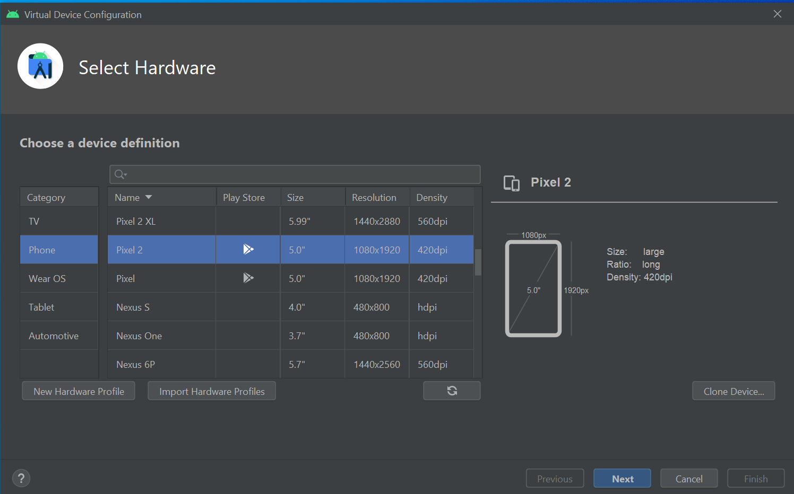

## Install Flutter

go to https://flutter.dev/ and download the SDK. It is a zip file.
Extract that content into C:\


add `c:\flutter\bin` into path environment variable.


Ensure that environment variable is set correctly.
go to command prompt and run the below command

```
where flutter dart
```


run `flutter doctor` command


## Install andriod studio

download and install [android studio](https://developer.android.com/studio)


once the installation is done, open the andriod studio.


select standard installation method.


select accept in the license agreement


installation is going on


### Create virtual device





Selected image will be installed.


run `flutter doctor --android-licenses` command to resolve the android licenses.

