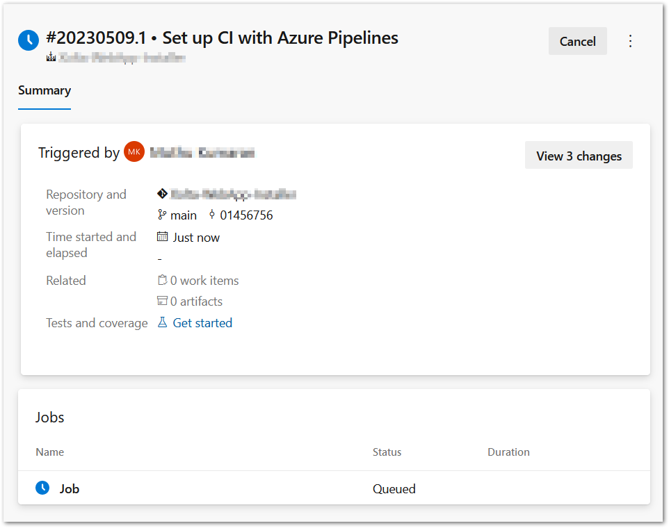

## Config the NextJs project

add `output` config as `standalone` in the `next.config.js`

```js
/** @type {import('next').NextConfig} */
const nextConfig = {
  reactStrictMode: true,
  output: 'standalone',
  webpack(config) {
    config.module.rules.push({
      test: /\.svg$/i,
      issuer: /\.[jt]sx?$/,
      use: ['@svgr/webpack'],
    })

    return config
  },
}

const withBundleAnalyzer = require('@next/bundle-analyzer')({
  enabled: false,
})
module.exports = withBundleAnalyzer(nextConfig)
```

Build nextJs using `npm run build`
After build, we can see a new folder `standalone` in the `.next` folder.


### Copy below folders into standalone folder

1. Copy public folder into ./next/standalone
2. Copy .next/static into ./next/standalone/static


### Run the standalone folder

open the standalone folder in a command prompt and run `node server.js` which will start the server.
Now, open the browser and go to localhost:3000 and ensure that the website is working fully.
We are going to deploy only the standalone folder.

## Create new pipeline

go to azure devops and pipelines then click "new pipeline"


select 'Azure repos git'


then select your repository.

Select Node.js from configure section.


we will get generated yaml code, just click 'Save and run'

You can edit the config file now or later. If you do later then you have to check-in the changes.

```
trigger:
  - none

pool:
  vmImage: ubuntu-latest

steps:
  - task: NodeTool@0
    inputs:
      versionSpec: "18.x"
    displayName: "Install Node.js"

  - script: |
      npm install
    displayName: "npm install"

  - script: |
      npm run build
    displayName: "npm build"

```

give a commit message and click 'save and run'


it's running, once done you can see success tick.


if you get any error then you have to fix the code then push the changes, once you pushed the pipeline will be triggered automatically. The `trigger` option in the yml config. But I have changed that to none, so I will trigger the pipeline manually.
