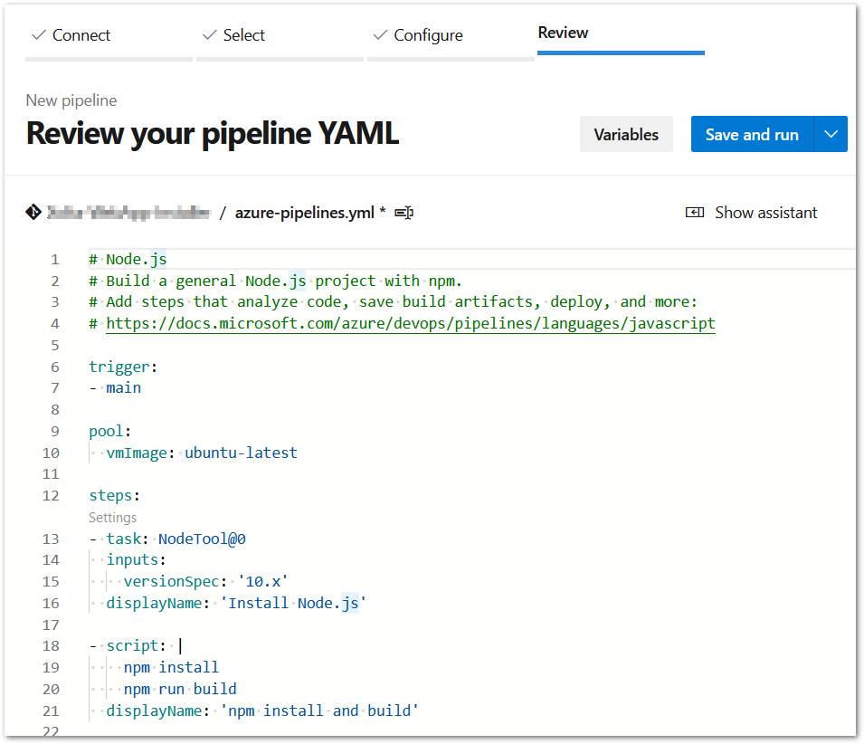

## Config the NextJs project

add `output` config as `standalone` in the `next.config.js`

```js
/** @type {import('next').NextConfig} */
const nextConfig = {
  reactStrictMode: true,
  output: 'standalone',
  webpack(config) {
    config.module.rules.push({
      test: /\.svg$/i,
      issuer: /\.[jt]sx?$/,
      use: ['@svgr/webpack'],
    })

    return config
  },
}

const withBundleAnalyzer = require('@next/bundle-analyzer')({
  enabled: false,
})
module.exports = withBundleAnalyzer(nextConfig)
```

Build nextJs using `npm run build`
After build, we can see a new folder `standalone` in the `.next` folder.


### Copy below folders into standalone folder

1. Copy public folder into ./next/standalone
2. Copy .next/static into ./next/standalone/static


### Run the standalone folder

open the standalone folder in a command prompt and run `node server.js` which will start the server.
Now, open the browser and go to localhost:3000 and ensure that the website is working fully.
We are going to deploy only the standalone folder.

## Create new pipeline

go to azure devops and pipelines then click "new pipeline"


select 'Azure repos git'


then select your repository.

Select Node.js from configure section.


we will get generated yaml code, just click 'Save and run'

You can edit the config file now or later. If you do later then you have to check-in the changes.

Below is my final yml.

```yml
trigger:
  - none

pool:
  vmImage: ubuntu-latest

steps:
  - task: NodeTool@0
    inputs:
      versionSpec: '18.x'
    displayName: 'Install Node.js'

  - script: |
      npm install
    displayName: 'npm install'

  - task: Cache@2
    displayName: 'Cache .next/cache'
    inputs:
      key: 'next | $(Agent.OS) | package-lock.json'
      path: '$(System.DefaultWorkingDirectory)/.next/cache'

  - script: |
      npm run build
    displayName: 'npm build'

  - task: CopyFiles@2
    displayName: 'Copy standalone'
    inputs:
      sourceFolder: '$(Build.SourcesDirectory)/.next/standalone'
      Contents: '**'
      TargetFolder: '$(Build.ArtifactStagingDirectory)/standalone'

  - task: CopyFiles@2
    displayName: 'Copy public'
    inputs:
      sourceFolder: '$(Build.SourcesDirectory)/public'
      Contents: '**'
      TargetFolder: '$(Build.ArtifactStagingDirectory)/standalone/public'

  - task: CopyFiles@2
    displayName: 'Copy .next/static'
    inputs:
      SourceFolder: '$(Build.SourcesDirectory)/.next/static/'
      Contents: '**'
      TargetFolder: '$(Build.ArtifactStagingDirectory)/standalone/.next/static'

  - task: ArchiveFiles@2
    inputs:
      rootFolderOrFile: '$(Build.ArtifactStagingDirectory)/standalone'
      includeRootFolder: false
      archiveType: 'zip'
      archiveFile: '$(Build.ArtifactStagingDirectory)/$(Build.BuildId).zip'
      replaceExistingArchive: true

  - task: PublishPipelineArtifact@1
    displayName: 'Publish artifact'
    inputs:
      targetPath: '$(Build.ArtifactStagingDirectory)/$(Build.BuildId).zip'
      artifact: '********'        <-- give your own name
      publishLocation: 'pipeline'
```

give a commit message and click 'save and run'


it's running, once done you can see success tick and published artifcate.


## Create new Azure service

In azure, we have to create a new `App service`
Here I have selected windows as OS, but I suggest you to stick with Linux for NodeJs.


In the next deployment tab, select disable, because we are not using GitHub's action.


Below is the final review+create screen for full information.


Once the service is created, you can see the running status.


Create slots for staging
Open the created app service
go to deployment slots section
add slot.


give a name for the slot.
Select the main app service in the clone settings dropdown.
Click add.


Once that's done, we can see one more app service with `slot`


## Create new Release

### Create staging release pipeline

Click Release, and new then `New release pipeline`


Select NodeJs as a template.


Give a name for stage, like test, dev, or pre-prod whatever. Then close this popup.


Name for the release pipeline


Select Artifact
select build pipeline
give a source alias


Select staging
Go to tasks tab


In parameter section click `unlink all`. I don't have that in the below screen.


1. Select run on agent
2. give a name for display
3. select azure pipelines
4. i have selected `windows` but better stick with `linux`
5. Ensure your artifact selected


Make changes in the `Deploy azure app service` like below image


### Create production release pipeline

clone staging to create production release


Change the stage name as production


It's important to change the production's slot as production.


Create relase


Select all, we will do manual trigger.

