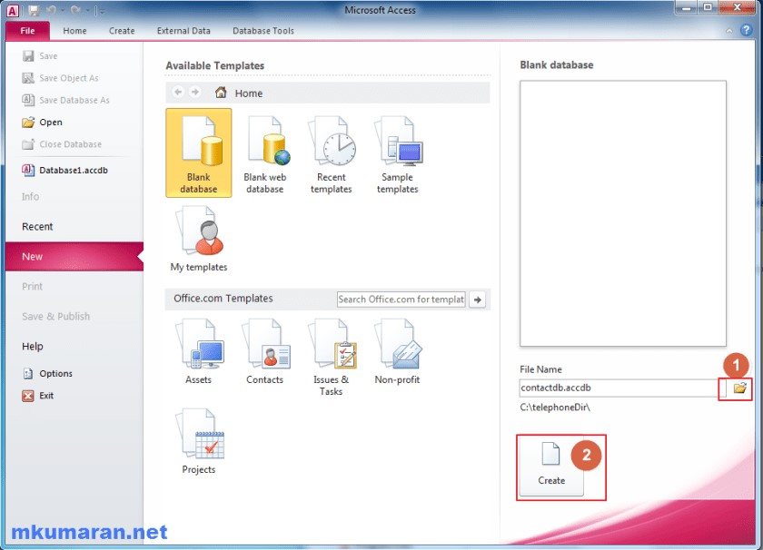
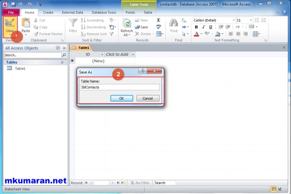
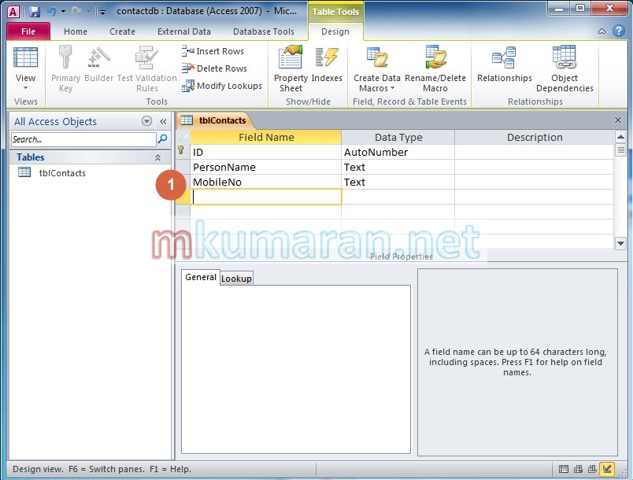
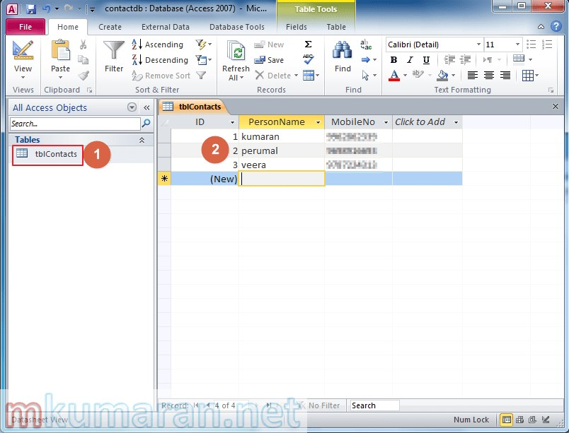
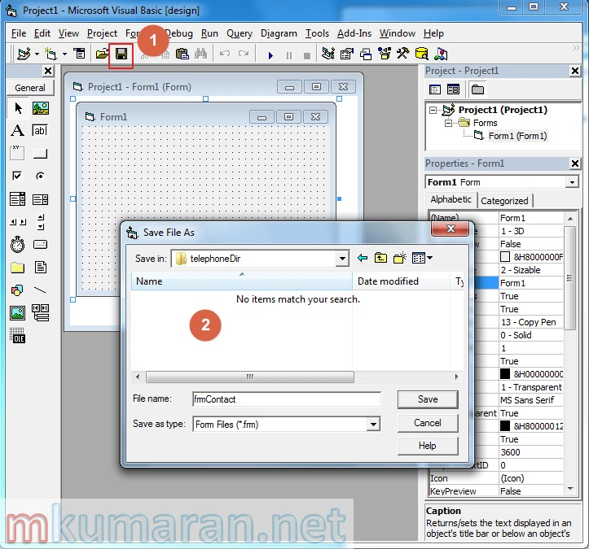
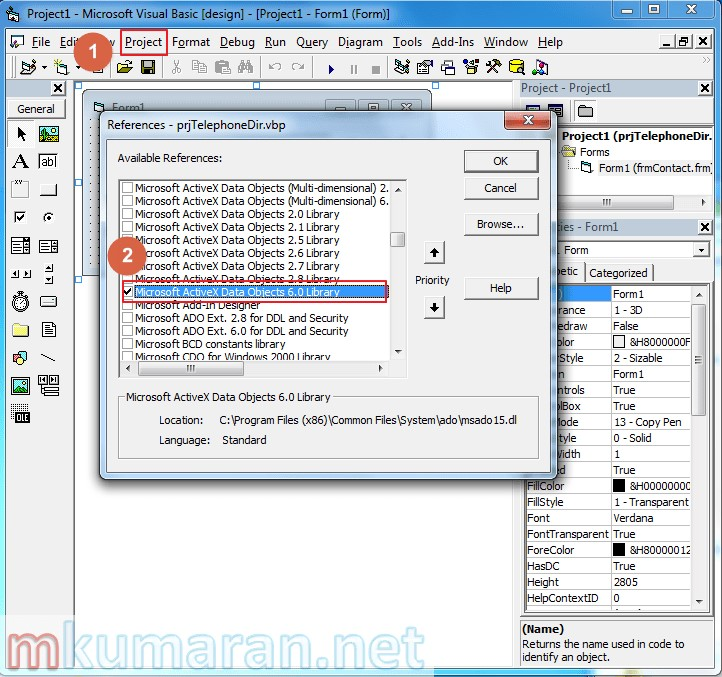
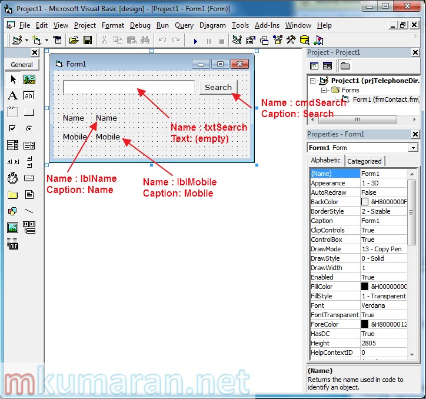
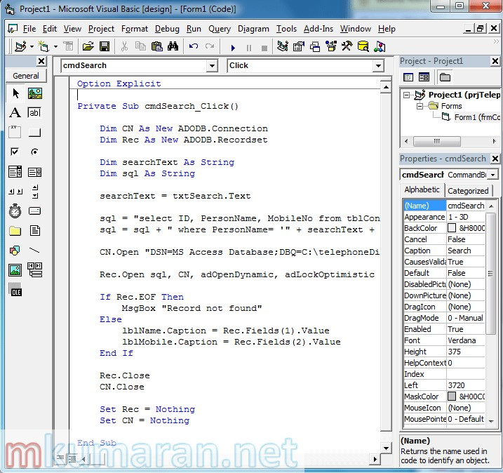
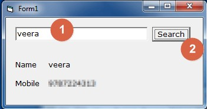

I will show absolute beginner tutorial for VB6.0 with database connections (using ADO). This will helpful you to get started further. I know VB 6.0 is quite old and It’s [IDE is no longer supported by Microsoft](http://blogs.msdn.com/b/nikosan/archive/2012/04/20/support-statement-for-visual-basic-6-0-on-windows-8.aspx). But still some legacy applications are running in VB6 runtime.

####VB6.0
VB6.0 was nice and great language for me to create database applications in the late 90’s. But nowadays people mostly use C#.net and WPF for window based applications. Also we don’t get any article from google for VB6.0. So I decide the write simple tutorial for those who want to learn database application in VB6.0 to support their legacy application.

We will see simple read only application which will search the name in database and fetch the relevant details into a form.


#####Step 1 : Create database

Create a new folder “C:\telephoneDir”


Open “MS-Access”. Click ‘Browse’ icon to select newly created folder (C:\telephoneDir) then click ‘Create’ button.



#####Step 2 : Create table

in MS-Access window click ‘Design’ view icon then give a table name as ‘tblContacts’, click ‘ok’.

1. Click ‘View design’ button from left top corner
2. give a name to table.

Once created the table, create fields for our table like the following.



#####Step 3 : Insert some rows
Once the table creation done, double click the table name from left pane then insert some rows into the table. Our application is going to get the information from this table.


1. Double click on table name 
2. Insert some rows

Save and close MS-Access.

#####Step 4 : Create VB6.0 project
Open Visual Basic 6.0. Create new ‘Standard Exe’ project. Save it inside the newly created folder(C:\telephoneDir) using tool bar icon.


1. Click tool bar save icon. 
2. give name for form also name for project.

while saving we have to name for our form and project.

#####Step 5 : ADO reference
Add ADO reference into the project. This is used to connect the database.

1. Project –> References 
2. Select ‘Microsoft ActiveX Data Objects 6.0 Library’

If you want to learn more about ADO then please refer the following links

* [The ADO Set of Records](http://www.functionx.com/vb6/Lesson17.htm)
* [Visual Basic 6 ADO Tutorial](http://www.timesheetsmts.com/adotutorial.htm)

#####Step 6 : Design the form
Design the form like the following. Drag and drop the controls from the left pane and change the properties(name and text/caption) from properties window.


#####Step 7 : Code
Double click the ‘search’ button from design mode and type the following code.



```VB
Option Explicit
 
Private Sub cmdSearch_Click()
 
    Dim CN As New ADODB.Connection
    Dim Rec As New ADODB.Recordset
     
    Dim searchText As String
    Dim sql As String
     
    searchText = txtSearch.Text
     
    'form the sql statement with search text
    sql = "select ID, PersonName, MobileNo from tblContacts"
    sql = sql + " where PersonName= '" + searchText + "'"
 
    'open the database connection
    CN.Open "DSN=MS Access Database;DBQ=C:\telephoneDir\contactdb.accdb;DefaultDir=C:\telephoneDir;DriverId=25;FIL=MS Access;MaxBufferSize=2048;PageTimeout=5;UID=admin;"
 
    'open the recordset(table) with sql query
    Rec.Open sql, CN, adOpenDynamic, adLockOptimistic
 
    'check that recordset has at-least one row to process
    If Rec.EOF Then
        MsgBox "Record not found"
    Else
        'display the recordset valus into the labels
        lblName.Caption = Rec.Fields(1).Value
        lblMobile.Caption = Rec.Fields(2).Value
    End If
 
    Rec.Close  'close the table(recordset)
    CN.Close  'close the connection
 
    'free up the memory
    Set Rec = Nothing
    Set CN = Nothing
     
End Sub
```

#####Step 8 : Run
Run the program (press F5)


1. type a name
2. click search